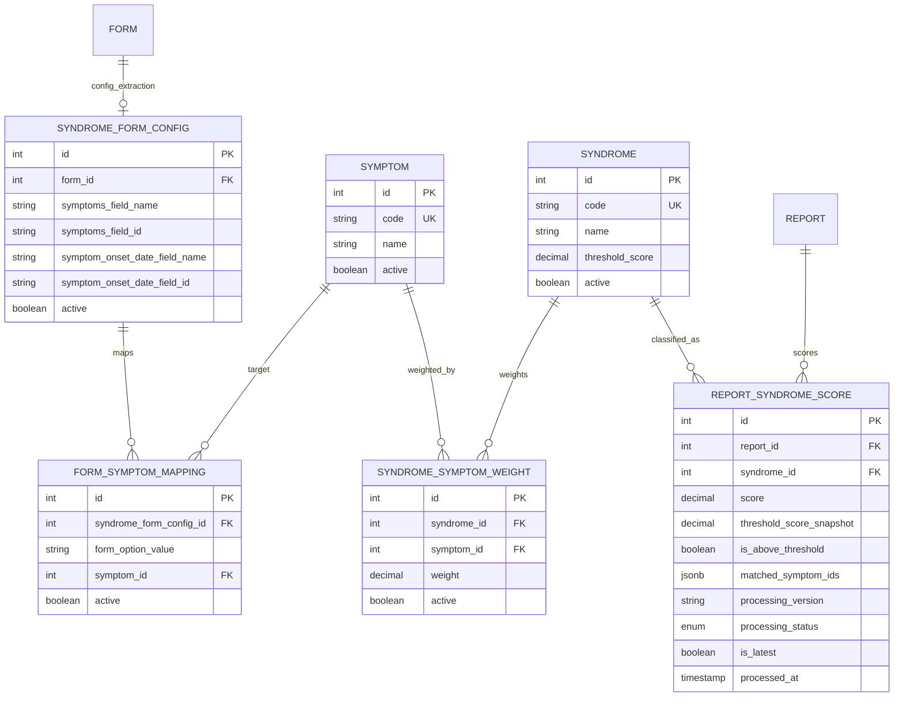

# Classificação sindrômica

Esta página descreve a **classificação sindrômica (motor V1 ponderado)**: objetivo de produto, fluxo ponta a ponta, **modelo de dados**, **API REST** e como isso aparece na **área de administração**.

:::info Documentação relacionada

- Formulários, versões e `report`: [Formulários e Relatórios](formularios-relatorios)
- Papéis e escopo por contexto: [Papéis e Permissões (RBAC)](papeis-permissoes-rbac)
- Export JSON para ferramentas de BI (chave `x-api-key`, console admin): [Integração BI — export sindrômico](/integracao-bi-export-sindromico)

:::

## Visão de produto

O sistema registra **relatórios de vigilância** (`report`) com respostas em JSON (`form_response`). A classificação sindrômica responde à pergunta: **dado o que o cidadão marcou como sintomas, em qual(is) síndrome(s) epidemiológicas esse quadro se aproxima**, de forma **reproduzível** e **ajustável** por gestores.

Motivações que as telas de admin cobrem:

1. **Vocabulário único (`symptom`)** — padronizar sintomas independentemente de como o app rotula opções no formulário.
2. **Definição de síndromes e limiares (`syndrome`)** — cada síndrome tem um **limiar** (`threshold_score`) entre 0 e 1; acima dele considera-se “compatível” para fins de contagem e filtros.
3. **Matriz síndrome × sintoma (`syndrome_symptom_weight`)** — pesos definem o quanto cada sintoma “puxa” o score da síndrome (motor ponderado).
4. **Extração por formulário (`syndrome_form_config`)** — indica **qual campo** do `form_response` contém os sintomas (nome lógico ou id do campo) e, opcionalmente, campo de data de início. A configuração é por **`form_id`**: **novas versões do mesmo formulário reutilizam a mesma configuração** (migração V37).
5. **Mapeamento valor → sintoma (`form_symptom_mapping`)** — quando o valor gravado no JSON **não** é idêntico ao `symptom.code`, o mapeamento associa o valor da opção ao sintoma canônico. Se não houver mapeamento, o backend aceita **fallback**: valor **igual** ao `symptom.code` (caso típico de multiselect que grava códigos estáveis).
6. **Relatórios e vigilância** — série **diária** de contagens por síndrome, **listagem paginada** dos registros de score, filtros (período, síndrome, acima do limiar, status de processamento), visualização de localização do report e **reprocessamento em lote** após mudanças de pesos ou de configuração.

O processamento roda **de forma assíncrona** após a criação/atualização relevante do report (disparo no backend); o resultado fica materializado em **`report_syndrome_score`**.

## Fluxo resumido

1. Cria-se/atualiza-se catálogo: sintomas, síndromes, pesos e (se necessário) mapeamentos por config de formulário.
2. Para cada `form` de vigilância que deve entrar no motor, cria-se uma **`syndrome_form_config` ativa** apontando o campo de sintomas (e opcionalmente data de início).
3. Ao chegar um **`report`** cujo `report_type` está no escopo configurado (ver variável de ambiente abaixo) e cujo `form_id` (via `form_version`) tem config ativa, o serviço:
   - extrai valores brutos do campo configurado;
   - resolve sintomas canônicos (mapeamento ou fallback por código);
   - para cada síndrome ativa, calcula score e grava linhas em `report_syndrome_score` (uma por síndrome em caso de sucesso), com `processing_version` = `v1-weighted`.
4. Gestores consultam totais diários e a tabela de scores; administradores podem **reprocessar** períodos ou reports após calibrar pesos ou extração.

## Motor de score (V1 ponderado)

Para cada síndrome ativa, somam-se os pesos **ativos** `syndrome_symptom_weight` dessa síndrome → `total_weight_sum`. Entre esses pesos, consideram-se apenas os sintomas presentes no report (após mapeamento) → `present_weight_sum`.

**Score** = `present_weight_sum / total_weight_sum` (0 se `total_weight_sum` = 0).

**Acima do limiar** quando `score >= syndrome.threshold_score` (comparado com o limiar vigente no momento do cálculo; também é guardado um snapshot em `report_syndrome_score.threshold_score_snapshot`).

## Escopo de `report_type` (implantação)

Variável de ambiente **`SYNDROMIC_CLASSIFICATION_REPORT_TYPE`** (opcional):

- `NEGATIVE` ou ausente → só entram reports com `report_type = NEGATIVE` (comportamento padrão).
- `POSITIVE` → só entram reports `POSITIVE`.
- Valor inválido → log de aviso e fallback para `NEGATIVE`.

Quando o tipo do report **não** é o elegível, o motor **não** classifica (métrica de negócio “skipped”; linhas anteriores daquele report podem ser removidas).

## Fuso e datas

Filtros por **dia civil** (`startDate` / `endDate` em `YYYY-MM-DD`) usam o fuso **`America/Sao_Paulo`** para converter início/fim do dia em UTC ao consultar `report.created_at`, evitando deslocamento por meia-noite UTC.

## Modelo de dados

### Diagrama (visão lógica)

### Tabelas

| Tabela | Função |
|--------|--------|
| `symptom` | Catálogo canônico de sintomas (`code` único). |
| `syndrome` | Catálogo de síndromes e `threshold_score` (0–1). |
| `syndrome_symptom_weight` | Peso por par (síndrome, sintoma); soma dos pesos define o denominador do score. |
| `syndrome_form_config` | Por `form_id` (único): onde ler sintomas e datas no `form_response`. |
| `form_symptom_mapping` | Opcional: valor de opção do formulário → `symptom_id` para aquela config. |
| `report_syndrome_score` | Resultado por processamento: uma linha por síndrome quando `processed`, ou linhas de `skipped` / `failed` conforme regras. Campo `is_latest` marca o snapshot atual por report. |

**Enum** `syndrome_processing_status`: `processed`, `skipped`, `failed`.

**Migrações Flyway:** `V33__syndromic_classification.sql` (criação); `V37__syndrome_form_config_form_id.sql` (config passa a referenciar `form_id` em vez de `form_version_id`).

## API REST

Prefixo global da API: **`/v1`**. Módulo: **`/syndromic-classification`**. Autenticação: **Bearer JWT** (Swagger: `bearerAuth`).

Resumo de **papéis** (`@Roles` no controller):

| Papéis | Escopo |
|--------|--------|
| `admin`, `manager` | Cadastros: sintomas, síndromes, pesos, matriz, configs de formulário, mapeamentos form→sintoma. |
| `admin`, `manager`, `participant` | Leitura: totais diários e lista paginada de scores (com **resolução de contexto** — ver abaixo). |
| `admin` apenas | `POST /reprocess` (reprocessamento em lote). |

### Resolução de contexto nas leituras

Os endpoints `GET .../reports/daily-syndrome-counts` e `GET .../reports/scores` usam `AuthzService.resolveListContextId` com **`allowParticipantContext: true`**:

- Participante enxerga dados do **seu** contexto de participação.
- Gestor/admin normalmente informa **`contextId`** na query; na UI de relatórios, **administrador precisa ter contexto selecionado** para habilitar as consultas (o backend exige o parâmetro nesse fluxo).

### Endpoints

#### Consultas e reprocessamento

| Método | Caminho | Descrição |
|--------|---------|-----------|
| `GET` | `/syndromic-classification/reports/daily-syndrome-counts` | Série diária de totais por síndrome. Query: `startDate`, `endDate` (obrigatórios), `contextId?`, `syndromeIds?` (CSV ou repetido), `onlyAboveThreshold?` (default true). |
| `GET` | `/syndromic-classification/reports/scores` | Lista paginada de `report_syndrome_score`. Query: paginação (`page`, `pageSize`), `contextId?`, `reportId?`, `syndromeId?`, `startDate?`, `endDate?`, `processingStatus?`, `isAboveThreshold?`, `onlyLatest?` (default true). |
| `POST` | `/syndromic-classification/reprocess` | Reprocessa em lote (somente **admin**). Body: `reportIds?`, `formId?`, `formVersionId?` (legado), `startDate?`, `endDate?`, `contextId?`, `onlyLatestActive?`, `limit?` (max 2000, default 100), `cursor?`. Resposta inclui contagens e `nextCursor` para paginação por `report_id`. |

#### Sintomas

| Método | Caminho |
|--------|---------|
| `GET` | `/syndromic-classification/symptoms` |
| `POST` | `/syndromic-classification/symptoms` |
| `PATCH` | `/syndromic-classification/symptoms/:id` |
| `DELETE` | `/syndromic-classification/symptoms/:id` |

#### Síndromes

| Método | Caminho |
|--------|---------|
| `GET` | `/syndromic-classification/syndromes` |
| `POST` | `/syndromic-classification/syndromes` |
| `PATCH` | `/syndromic-classification/syndromes/:id` |
| `DELETE` | `/syndromic-classification/syndromes/:id` |

#### Pesos síndrome × sintoma

| Método | Caminho |
|--------|---------|
| `GET` | `/syndromic-classification/syndrome-symptom-weights` |
| `POST` | `/syndromic-classification/syndrome-symptom-weights` |
| `PATCH` | `/syndromic-classification/syndrome-symptom-weights/:id` |
| `DELETE` | `/syndromic-classification/syndrome-symptom-weights/:id` |
| `GET` | `/syndromic-classification/syndrome-symptom-weights/matrix` |
| `PUT` | `/syndromic-classification/syndrome-symptom-weights/matrix` | Corpo: `cells[]` com `syndromeId`, `symptomId`, `weight`, `active?` (até 5000 células). |

#### Configuração de extração por formulário

| Método | Caminho |
|--------|---------|
| `GET` | `/syndromic-classification/syndrome-form-configs` |
| `POST` | `/syndromic-classification/syndrome-form-configs` |
| `PATCH` | `/syndromic-classification/syndrome-form-configs/:id` |
| `DELETE` | `/syndromic-classification/syndrome-form-configs/:id` |

#### Mapeamento opção de formulário → sintoma

| Método | Caminho |
|--------|---------|
| `GET` | `/syndromic-classification/form-symptom-mappings` |
| `POST` | `/syndromic-classification/form-symptom-mappings` |
| `PATCH` | `/syndromic-classification/form-symptom-mappings/:id` |
| `DELETE` | `/syndromic-classification/form-symptom-mappings/:id` |

Detalhes de corpos de requisição e exemplos seguem o **OpenAPI/Swagger** do backend (`SyndromicClassificationController` e DTOs em `syndromic-classification.dto.ts`).

## Interface web (administração)

Rotas no frontend (área autenticada `/admin`), menu **Classificação Sindrômica** (papéis **admin** e **manager**):

| Rota | Tela |
|------|------|
| `/admin/syndromic/symptoms` | Cadastro de sintomas canônicos |
| `/admin/syndromic/syndromes` | Cadastro de síndromes e limiares |
| `/admin/syndromic/weights` | Matriz de pesos (planilha) |
| `/admin/syndromic/form-configs` | Configuração de extração por formulário |
| `/admin/syndromic/reports` | Relatórios: gráfico diário, tabela de scores, mapa, reprocessamento (**somente admin**) |

Participantes com perfil adequado podem consumir as APIs de consulta conforme regras de contexto; o menu acima é restrito a admin/manager.

## Auditoria e métricas

- Reprocessamento em lote registra evento de auditoria (`SYNDROME_REPROCESS_TRIGGER`) com parâmetros e contadores.
- Métricas de negócio incluem classificação (`processed` / `skipped` / `failed`) e geração de score por código de síndrome.

---

**Última atualização**: abril de 2026 (alinhado ao código em `backend/src/syndromic-classification` e migrações V33/V37).
