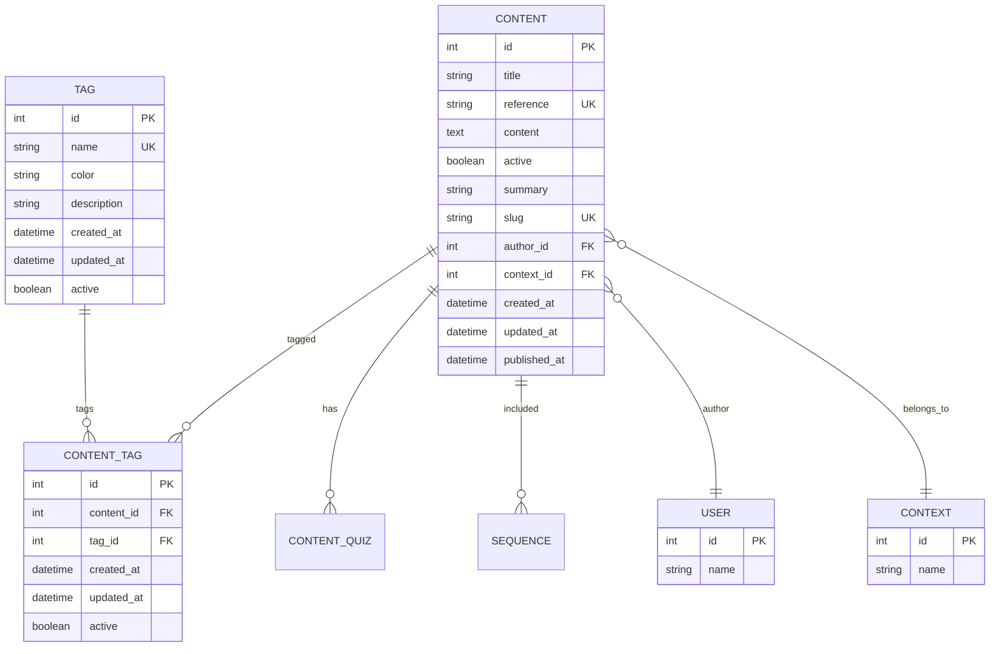

# Conteúdo e Tags

Esta seção detalha o modelo de dados relacionado a conteúdos educacionais e sistema de tags.

## Diagrama



## Tabelas

### CONTENT

Artigos e materiais educacionais com versionamento e publicação.

| Campo | Tipo | Descrição |
|-------|------|-----------|
| `id` | INT | Identificador único (PK) |
| `title` | VARCHAR(200) | Título do conteúdo |
| `reference` | VARCHAR(50) | Código de referência único (ex: "CON-001") |
| `content` | TEXT | Conteúdo HTML formatado |
| `active` | BOOLEAN | Status de publicação (default: false) |
| `summary` | VARCHAR(500) | Resumo do conteúdo |
| `slug` | VARCHAR(255) | Slug único para URLs amigáveis |
| `author_id` | INT | Referência ao autor (FK → user.id) |
| `context_id` | INT | Referência ao contexto (FK → context.id, opcional) |
| `created_at` | TIMESTAMP | Data de criação |
| `updated_at` | TIMESTAMP | Data de última atualização |
| `published_at` | TIMESTAMP | Data de publicação (opcional) |

**Constraints:**
- UNIQUE (reference) - Código de referência único
- UNIQUE (slug) - Slug único para URLs

**Índices:**
- `idx_content_active` (active)
- `idx_content_author_id` (author_id)
- `idx_content_context_id` (context_id)
- `idx_content_created_at` (created_at)
- `idx_content_reference` (reference)
- `idx_content_slug_idx` (slug)
- `idx_content_title` (title)

### TAG

Tags para categorização de conteúdos.

| Campo | Tipo | Descrição |
|-------|------|-----------|
| `id` | INT | Identificador único (PK) |
| `name` | VARCHAR(100) | Nome da tag (único) |
| `color` | VARCHAR(7) | Cor hexadecimal (ex: "#FF5733") |
| `description` | VARCHAR(255) | Descrição da tag |
| `created_at` | TIMESTAMP | Data de criação |
| `updated_at` | TIMESTAMP | Data de última atualização |
| `active` | BOOLEAN | Status ativo/inativo |

**Constraints:**
- UNIQUE (name) - Nome único

**Índices:**
- `idx_tag_name_idx` (name)

### CONTENT_TAG

Relação N:N entre conteúdos e tags.

| Campo | Tipo | Descrição |
|-------|------|-----------|
| `id` | INT | Identificador único (PK) |
| `content_id` | INT | Referência ao conteúdo (FK → content.id) |
| `tag_id` | INT | Referência à tag (FK → tag.id) |
| `created_at` | TIMESTAMP | Data de criação |
| `updated_at` | TIMESTAMP | Data de última atualização |
| `active` | BOOLEAN | Status ativo/inativo |

**Constraints:**
- UNIQUE (content_id, tag_id) - Um conteúdo não pode ter a mesma tag duas vezes

**Índices:**
- `idx_content_tag_content_id` (content_id)
- `idx_content_tag_tag_id` (tag_id)

## Relacionamentos

1. **CONTENT → USER** (author): Um conteúdo tem um autor
2. **CONTENT → CONTEXT**: Um conteúdo pode pertencer a um contexto (opcional)
3. **CONTENT → CONTENT_TAG**: Um conteúdo pode ter múltiplas tags
4. **TAG → CONTENT_TAG**: Uma tag pode estar associada a múltiplos conteúdos
5. **CONTENT → CONTENT_QUIZ**: Um conteúdo pode ter quizzes associados
6. **CONTENT → SEQUENCE**: Um conteúdo pode ser incluído em sequências de trilhas

## Regras de Negócio

### Conteúdo

- Todo conteúdo deve ter um autor
- O campo `reference` é único e serve como código identificador (ex: "CON-001")
- O campo `slug` é único e usado para URLs amigáveis (ex: "introducao-ao-sistema")
- O campo `active` controla se o conteúdo está publicado
- O campo `published_at` registra quando o conteúdo foi publicado
- Um conteúdo pode pertencer a um contexto (opcional)
- Ao excluir um conteúdo, suas tags são excluídas (CASCADE)

### Tags

- Tags têm nomes únicos
- Tags podem ter cores para identificação visual
- Tags podem ser desativadas sem excluir associações existentes
- Ao excluir uma tag, suas associações com conteúdos são excluídas (CASCADE)

### Associação Conteúdo-Tag

- Um conteúdo pode ter múltiplas tags
- Uma tag pode estar associada a múltiplos conteúdos
- A relação é única (um conteúdo não pode ter a mesma tag duas vezes)
- A associação pode ser desativada sem excluir o registro

## Consultas Comuns

### Buscar conteúdos por tag

```sql
SELECT c.*
FROM content c
INNER JOIN content_tag ct ON c.id = ct.content_id
WHERE ct.tag_id = ?
  AND c.active = true
  AND ct.active = true
ORDER BY c.published_at DESC;
```

### Buscar tags de um conteúdo

```sql
SELECT t.*
FROM tag t
INNER JOIN content_tag ct ON t.id = ct.tag_id
WHERE ct.content_id = ?
  AND t.active = true
  AND ct.active = true;
```

### Buscar conteúdos publicados de um contexto

```sql
SELECT c.*, u.name as author_name
FROM content c
INNER JOIN user u ON c.author_id = u.id
WHERE c.context_id = ?
  AND c.active = true
  AND c.published_at IS NOT NULL
ORDER BY c.published_at DESC;
```

### Buscar conteúdos por slug

```sql
SELECT * FROM content
WHERE slug = ? AND active = true;
```
