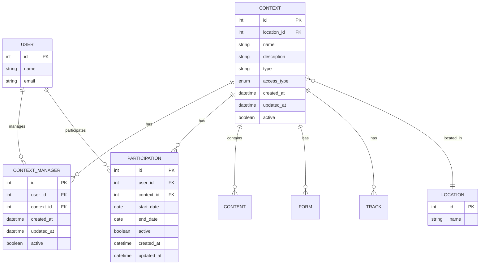

# Contextos e Participação

Esta seção detalha o modelo de dados relacionado a contextos de trabalho/comunidade e participação de usuários.

## Diagrama



## Tabelas

### CONTEXT

Contextos representam comunidades, grupos de trabalho ou ambientes organizacionais.

| Campo | Tipo | Descrição |
|-------|------|-----------|
| `id` | INT | Identificador único (PK) |
| `location_id` | INT | Referência à localização (FK → location.id, opcional) |
| `name` | VARCHAR(255) | Nome do contexto |
| `description` | TEXT | Descrição do contexto |
| `type` | VARCHAR(255) | Tipo do contexto (ex: "community", "organization") |
| `access_type` | ENUM | Tipo de acesso: `PUBLIC` ou `PRIVATE` |
| `created_at` | TIMESTAMP | Data de criação |
| `updated_at` | TIMESTAMP | Data de última atualização |
| `active` | BOOLEAN | Status ativo/inativo |

**Enums:**
- `context_access_type`: `PUBLIC`, `PRIVATE`

**Índices:**
- `idx_context_location_id` (location_id)

### CONTEXT_MANAGER

Gerentes de contexto - usuários que gerenciam um contexto específico.

| Campo | Tipo | Descrição |
|-------|------|-----------|
| `id` | INT | Identificador único (PK) |
| `user_id` | INT | Referência ao usuário gerente (FK → user.id) |
| `context_id` | INT | Referência ao contexto (FK → context.id) |
| `created_at` | TIMESTAMP | Data de criação |
| `updated_at` | TIMESTAMP | Data de última atualização |
| `active` | BOOLEAN | Status ativo/inativo |

**Constraints:**
- UNIQUE (user_id, context_id) - Um usuário só pode ser gerente uma vez por contexto

**Índices:**
- `idx_context_manager_context_id` (context_id)
- `idx_context_manager_user_id` (user_id)

### PARTICIPATION

Participação de usuários em contextos com período de vigência.

| Campo | Tipo | Descrição |
|-------|------|-----------|
| `id` | INT | Identificador único (PK) |
| `user_id` | INT | Referência ao usuário (FK → user.id) |
| `context_id` | INT | Referência ao contexto (FK → context.id) |
| `start_date` | DATE | Data de início da participação |
| `end_date` | DATE | Data de término da participação (opcional) |
| `active` | BOOLEAN | Status ativo/inativo |
| `created_at` | TIMESTAMP | Data de criação |
| `updated_at` | TIMESTAMP | Data de última atualização |

**Índices:**
- `idx_participation_context_id` (context_id)
- `idx_participation_user_id` (user_id)

## Relacionamentos

1. **CONTEXT → LOCATION**: Um contexto pode estar vinculado a uma localização
2. **CONTEXT → CONTEXT_MANAGER**: Um contexto pode ter múltiplos gerentes
3. **CONTEXT → PARTICIPATION**: Um contexto pode ter múltiplas participações
4. **CONTEXT → CONTENT**: Um contexto pode conter múltiplos conteúdos
5. **CONTEXT → FORM**: Um contexto pode ter múltiplos formulários
6. **CONTEXT → TRACK**: Um contexto pode ter múltiplas trilhas de aprendizado
7. **USER → CONTEXT_MANAGER**: Um usuário pode gerenciar múltiplos contextos
8. **USER → PARTICIPATION**: Um usuário pode participar de múltiplos contextos

## Regras de Negócio

### Contextos

- Contextos `PUBLIC` são acessíveis a todos os usuários
- Contextos `PRIVATE` são acessíveis apenas a participantes e gerentes
- Um contexto pode estar vinculado a uma localização (opcional)
- Ao excluir um contexto, todas as participações são excluídas (CASCADE)

### Gerentes de Contexto

- Um usuário pode ser gerente de múltiplos contextos
- Um contexto pode ter múltiplos gerentes
- Gerentes têm permissões administrativas no contexto
- A relação gerente-contexto é única (um usuário não pode ser gerente duas vezes do mesmo contexto)

### Participações

- Um usuário pode participar de múltiplos contextos
- Uma participação tem data de início obrigatória
- Uma participação pode ter data de término (opcional) - participação temporária
- Se `end_date` for NULL, a participação é permanente
- O campo `active` controla se a participação está ativa no momento
- Ao excluir um usuário, suas participações são excluídas (CASCADE)
- Ao excluir um contexto, todas as participações são excluídas (CASCADE)

## Consultas Comuns

### Verificar se usuário participa de um contexto

```sql
SELECT * FROM participation
WHERE user_id = ? 
  AND context_id = ?
  AND active = true
  AND (end_date IS NULL OR end_date >= CURRENT_DATE)
  AND start_date <= CURRENT_DATE;
```

### Listar contextos gerenciados por um usuário

```sql
SELECT c.* 
FROM context c
INNER JOIN context_manager cm ON c.id = cm.context_id
WHERE cm.user_id = ? AND cm.active = true AND c.active = true;
```

### Listar participantes ativos de um contexto

```sql
SELECT u.*, p.start_date, p.end_date
FROM participation p
INNER JOIN user u ON p.user_id = u.id
WHERE p.context_id = ?
  AND p.active = true
  AND u.active = true
  AND (p.end_date IS NULL OR p.end_date >= CURRENT_DATE)
  AND p.start_date <= CURRENT_DATE;
```
