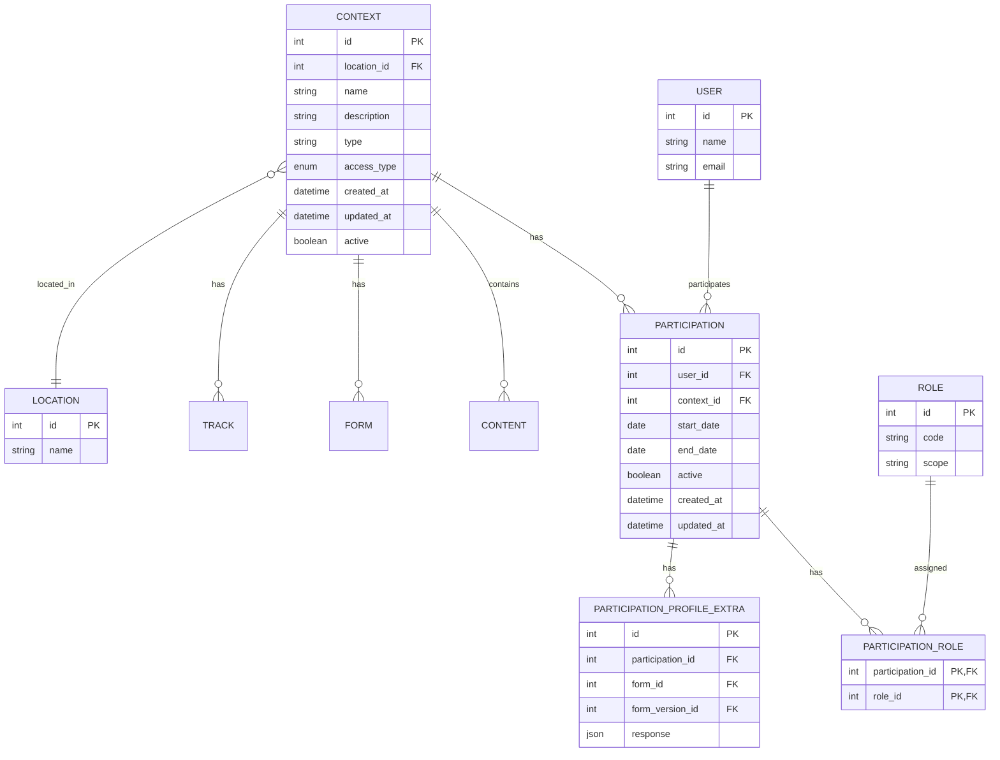

# Contextos e Participação

:::tip Configuração operacional

Para **chaves de `context_configuration`**, **módulos** e **integração de reports** por contexto, veja [Configuração de contexto e integrações de reports](../configuracao-contexto-e-integracoes).

:::

Esta seção detalha o modelo de dados relacionado a contextos de trabalho/comunidade e participação de usuários. O controle de **quem gerencia** um contexto é feito via **papéis e permissões (RBAC)**: veja [Papéis e Permissões (RBAC)](papeis-permissoes-rbac).

## Diagrama


```mermaid
erDiagram
    CONTEXT ||--o{ PARTICIPATION : "has"
    CONTEXT ||--o{ CONTENT : "contains"
    CONTEXT ||--o{ FORM : "has"
    CONTEXT ||--o{ TRACK : "has"
    CONTEXT }o--|| LOCATION : "located_in"
    
    USER ||--o{ PARTICIPATION : "participates"
    PARTICIPATION ||--o{ PARTICIPATION_ROLE : "has"
    PARTICIPATION ||--o{ PARTICIPATION_PROFILE_EXTRA : "has"
    ROLE ||--o{ PARTICIPATION_ROLE : "assigned"
    
    CONTEXT {
        int id PK
        int location_id FK
        string name
        string description
        string type
        enum access_type
        datetime created_at
        datetime updated_at
        boolean active
    }
    
    PARTICIPATION {
        int id PK
        int user_id FK
        int context_id FK
        date start_date
        date end_date
        boolean active
        datetime created_at
        datetime updated_at
    }
    
    PARTICIPATION_ROLE {
        int participation_id PK,FK
        int role_id PK,FK
    }
    
    PARTICIPATION_PROFILE_EXTRA {
        int id PK
        int participation_id FK
        int form_id FK
        int form_version_id FK
        json response
    }
    
    ROLE {
        int id PK
        string code
        string scope
    }
    
    USER {
        int id PK
        string name
        string email
    }
    
    LOCATION {
        int id PK
        string name
    }
```

## Tabelas

### CONTEXT

Contextos representam comunidades, grupos de trabalho ou ambientes organizacionais.

| Campo | Tipo | Descrição |
|-------|------|-----------|
| `id` | INT | Identificador único (PK) |
| `location_id` | INT | Referência à localização (FK → location.id, opcional) |
| `name` | VARCHAR(255) | Nome do contexto |
| `description` | TEXT | Descrição do contexto |
| `type` | VARCHAR(255) | Tipo do contexto (ex: "community", "organization") |
| `access_type` | ENUM | Tipo de acesso: `PUBLIC` ou `PRIVATE` |
| `created_at` | TIMESTAMP | Data de criação |
| `updated_at` | TIMESTAMP | Data de última atualização |
| `active` | BOOLEAN | Status ativo/inativo |

**Enums:**
- `context_access_type`: `PUBLIC`, `PRIVATE`

**Índices:**
- `idx_context_location_id` (location_id)

### PARTICIPATION

Participação de usuários em contextos com período de vigência. Todo usuário que atua em um contexto (como participante, gerente ou gerente de conteúdo) possui **uma** participação por contexto.

| Campo | Tipo | Descrição |
|-------|------|-----------|
| `id` | INT | Identificador único (PK) |
| `user_id` | INT | Referência ao usuário (FK → user.id) |
| `context_id` | INT | Referência ao contexto (FK → context.id) |
| `start_date` | DATE | Data de início da participação |
| `end_date` | DATE | Data de término da participação (opcional) |
| `active` | BOOLEAN | Status ativo/inativo |
| `created_at` | TIMESTAMP | Data de criação |
| `updated_at` | TIMESTAMP | Data de última atualização |

**Índices:**
- `idx_participation_context_id` (context_id)
- `idx_participation_user_id` (user_id)

### PARTICIPATION_ROLE

Papéis do usuário **nesse** contexto. Uma mesma participação pode ter vários papéis (ex.: `manager`, `participant`). PK composta: `(participation_id, role_id)`.

| Campo | Tipo | Descrição |
|-------|------|-----------|
| `participation_id` | INT | FK → participation.id |
| `role_id` | INT | FK → role.id |

Os papéis (tabela `role`) incluem `manager`, `content_manager` e `participant` com escopo `context`. A autorização é feita via RBAC; detalhes em [Papéis e Permissões (RBAC)](papeis-permissoes-rbac).

## Relacionamentos

1. **CONTEXT → LOCATION**: Um contexto pode estar vinculado a uma localização
2. **CONTEXT → PARTICIPATION**: Um contexto pode ter múltiplas participações
3. **CONTEXT → CONTENT**: Um contexto pode conter múltiplos conteúdos
4. **CONTEXT → FORM**: Um contexto pode ter múltiplos formulários
5. **CONTEXT → TRACK**: Um contexto pode ter múltiplas trilhas de aprendizado
6. **USER → PARTICIPATION**: Um usuário pode participar de múltiplos contextos
7. **PARTICIPATION → PARTICIPATION_ROLE**: Uma participação pode ter vários papéis (manager, content_manager, participant)
8. **ROLE → PARTICIPATION_ROLE**: Papéis atribuídos por contexto
9. **PARTICIPATION → PARTICIPATION_PROFILE_EXTRA**: Dados adicionais de perfil (`profile_extra`) vinculados à participação; modelo e API em [Formulários e Relatórios](formularios-relatorios#participation_profile_extra) e [Dados adicionais de perfil](dados-adicionais-perfil)

## Regras de Negócio

### Contextos

- Contextos `PUBLIC` são acessíveis a todos os usuários
- Contextos `PRIVATE` são acessíveis apenas a participantes e gerentes
- Um contexto pode estar vinculado a uma localização (opcional)
- Ao excluir um contexto, todas as participações são excluídas (CASCADE)
- Apenas usuários com papel **admin** (global) podem criar, editar ou remover contextos

### Gerentes e papéis no contexto

- Quem **gerencia** um contexto tem a participação com papel `manager` em `participation_role`
- Quem gerencia **apenas conteúdo** tem o papel `content_manager`
- A API de "managers do contexto" (`/contexts/:contextId/managers`) trabalha com participação + `participation_role`; o identificador exposto é o `participation.id`
- Apenas **admin** ou **manager** do contexto podem adicionar/remover managers

### Participações

- Um usuário pode participar de múltiplos contextos (uma participação por par user + contexto)
- Toda nova participação criada pela API recebe automaticamente o papel `participant`
- Uma participação tem data de início obrigatória
- Uma participação pode ter data de término (opcional) — participação temporária
- Se `end_date` for NULL, a participação é permanente
- O campo `active` controla se a participação está ativa no momento
- Ao excluir um usuário, suas participações são excluídas (CASCADE)
- Ao excluir um contexto, todas as participações são excluídas (CASCADE)

## Consultas Comuns

### Verificar se usuário participa de um contexto

```sql
SELECT * FROM participation
WHERE user_id = ?
  AND context_id = ?
  AND active = true
  AND (end_date IS NULL OR end_date >= CURRENT_DATE)
  AND start_date <= CURRENT_DATE;
```

### Listar contextos em que o usuário é manager ou content_manager

```sql
SELECT c.*
FROM context c
INNER JOIN participation p ON p.context_id = c.id
INNER JOIN participation_role pr ON pr.participation_id = p.id
INNER JOIN role r ON r.id = pr.role_id
WHERE p.user_id = ?
  AND p.active = true
  AND c.active = true
  AND r.code IN ('manager', 'content_manager');
```

### Listar participantes ativos de um contexto

```sql
SELECT u.*, p.start_date, p.end_date
FROM participation p
INNER JOIN "user" u ON p.user_id = u.id
WHERE p.context_id = ?
  AND p.active = true
  AND u.active = true
  AND (p.end_date IS NULL OR p.end_date >= CURRENT_DATE)
  AND p.start_date <= CURRENT_DATE;
```
