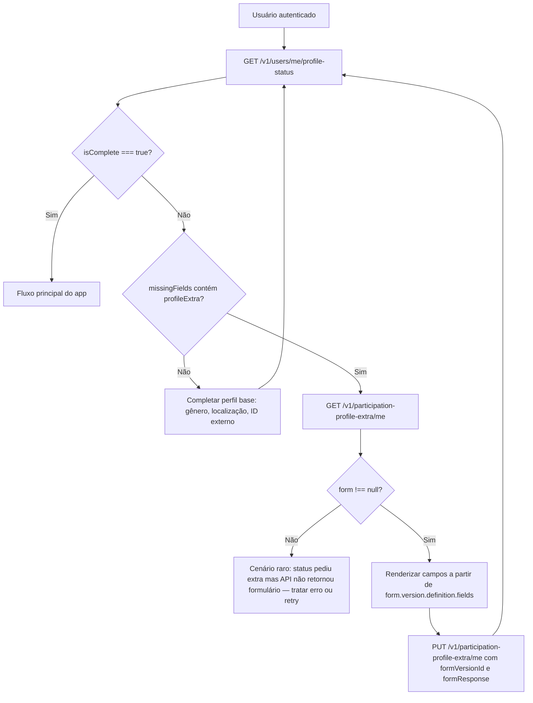

# Dados adicionais de perfil (`profile_extra`)

Esta página descreve o **caso de uso de dados adicionais de perfil**: formulários configuráveis por **contexto**, vinculados à **participação ativa** do usuário. Serve para alinhar **aplicativo móvel (Android/iOS)**, **web do cidadão** e **administração** sobre o mesmo contrato da API.

:::info Relação com o modelo de dados

- Tipo de formulário `profile_extra` e tabela `participation_profile_extra`: [Formulários e Relatórios](formularios-relatorios#participation_profile_extra)
- Participação e contexto: [Contextos e Participação](contextos-participacao)
- Campos fixos do usuário (gênero, localização, identificador externo): [Usuários e Autenticação](usuarios-autenticacao)

:::

## Visão geral

Além dos campos padrão do perfil (`genderId`, `locationId`, `externalIdentifier`), um contexto pode exigir **campos extras** definidos por um formulário do tipo **`profile_extra`**. O back-end:

1. Descobre a **participação ativa** do usuário (mesma regra de datas e `active` usada no login).
2. Busca, nesse contexto, **um** formulário `profile_extra` ativo (se houver mais de um, usa o de **menor `id`**).
3. Usa a **versão ativa mais recente** (`version_number` desc) que tenha `definition.fields` **não vazio**.
4. Exige submissão quando esse formulário existe e a participação ainda **não** gravou resposta para a **versão atual** (ver [regras de completude](#quando-o-preenchimento-é-obrigatório)).

Os dados ficam em `participation_profile_extra` (uma linha por par **participação + formulário**), com upsert na API.

## Base da API e autenticação

- **Prefixo global**: `v1` (ex.: `https://<host>/v1/...`).
- **Autenticação**: `Authorization: Bearer <access_token>` (JWT) em todos os endpoints abaixo.

Substitua `<host>` pelo ambiente (desenvolvimento, homologação, produção).

## Fluxo recomendado para o app (Android / iOS)



1. Após **login** ou **cadastro**, e sempre que o perfil possa ter mudado, chamar **`GET /v1/users/me/profile-status`**.
2. Se `missingFields` incluir **`profileExtra`**, abrir a tela de dados adicionais.
3. Chamar **`GET /v1/participation-profile-extra/me`** para obter a definição (`form`) e respostas já salvas (`submission`).
4. Montar a UI a partir de **`form.version.definition`** (estrutura JSON de campos, alinhada aos demais formulários do sistema).
5. Enviar **`PUT /v1/participation-profile-extra/me`** com o **`formVersionId`** retornado e um objeto **`formResponse`** cujas chaves são os **`name`** dos campos na definição.
6. Voltar ao passo 1 até `isComplete` ser `true` (e ausência de `profileExtra` em `missingFields` se aplicável).

:::tip Ordem em relação ao perfil base

O status considera **primeiro** gênero, localização e identificador externo, e **também** os dados adicionais quando o contexto exige. O app pode orientar o usuário a preencher o perfil base e, em seguida, os dados adicionais, ou unificar em um fluxo — desde que, ao final, `GET .../profile-status` indique conclusão.

:::

## `GET /v1/users/me/profile-status`

Consolida o estado do perfil para **gating** no cliente.

**Resposta** (campos relevantes para este caso de uso):

| Campo | Tipo | Descrição |
|-------|------|-----------|
| `isComplete` | boolean | `true` quando o perfil base está completo **e** (se `profileExtraRequired`) a submissão extra está alinhada à versão atual |
| `missingFields` | string[] | Pode incluir `genderId`, `locationId`, `externalIdentifier`, **`profileExtra`** |
| `profile` | objeto | Valores atuais de gênero, localização e identificador externo |
| `profileExtraRequired` | boolean | Contexto tem formulário `profile_extra` aplicável com campos obrigatórios na prática (versão com `fields` não vazio) |
| `profileExtraComplete` | boolean | Já existe submissão ativa para a **versão atual** do formulário |

**Exemplo** (usuário com perfil base OK, mas falta dados adicionais):

```json
{
  "isComplete": false,
  "missingFields": ["profileExtra"],
  "profile": { "genderId": 1, "locationId": 10, "externalIdentifier": "123" },
  "profileExtraRequired": true,
  "profileExtraComplete": false
}
```

## `GET /v1/participation-profile-extra/me`

Retorna o formulário aplicável à **participação ativa** e a submissão existente.

- **`form`**: `null` se não houver participação ativa, não houver formulário `profile_extra` ativo no contexto, não houver versão ativa ou a versão não tiver campos (`definition.fields` vazio).
- **`submission`**: `null` se não houver registro ativo em `participation_profile_extra`; caso contrário reflete a última resposta (atenção: pode ser de **versão antiga** — o cliente deve comparar `submission.formVersionId` com `form.version.id` para saber se precisa re-preencher).

**Exemplo** (formulário disponível, ainda sem resposta):

```json
{
  "form": {
    "id": 12,
    "title": "Dados complementares",
    "reference": "PERFIL_EXTRA_01",
    "type": "profile_extra",
    "version": {
      "id": 88,
      "formId": 12,
      "versionNumber": 1,
      "accessType": "PUBLIC",
      "definition": { "fields": [ { "name": "profissao", "label": "Profissão", "type": "text" } ] },
      "active": true,
      "createdAt": "...",
      "updatedAt": "..."
    }
  },
  "submission": null
}
```

## `PUT /v1/participation-profile-extra/me`

**Corpo** (JSON):

| Campo | Tipo | Descrição |
|-------|------|-----------|
| `formVersionId` | number | ID da **`form.version.id`** retornada em `GET .../me` (versão ativa esperada pelo servidor) |
| `formResponse` | objeto | Mapa **nome do campo → valor** (mesma convenção de outros formulários: chaves = `name` em `definition.fields`) |

**Exemplo:**

```json
{
  "formVersionId": 88,
  "formResponse": {
    "profissao": "Enfermeira",
    "telefone_emergencia": "61999990000"
  }
```

**Resposta** (200): objeto com `formVersionId`, `response` (eco das respostas persistidas) e `updatedAt`.

## Montagem da UI a partir de `definition`

- Reutilize a mesma lógica (ou componentes) que o app já usa para **quiz** ou **sinal**, quando aplicável: a estrutura de **`definition`** segue o padrão de versões de formulário do GDS.
- Validações obrigatórias no cliente devem refletir o que a definição JSON expressar (tipo, obrigatoriedade, etc.), mantendo paridade com a **área administrativa** que criou o formulário.

## Quando o preenchimento é obrigatório

O back-end considera **obrigatório** (`profileExtraRequired: true`) quando:

- Existe participação ativa para o usuário;
- Existe formulário **`profile_extra`** ativo no **mesmo** `context_id`;
- Existe versão **ativa** com `definition.fields` com pelo menos um item.

Considera-se **completo** (`profileExtraComplete: true`) quando existe linha em `participation_profile_extra` **ativa**, para aquele par participação + formulário, com **`form_version_id` igual ao ID da versão atual** usada na regra acima. Se a administração publicar **nova versão** do formulário, o usuário pode voltar a aparecer como incompleto até novo `PUT`.

## Erros HTTP comuns (`PUT .../me`)

| Status | Situação |
|--------|----------|
| **400** | Sem participação ativa; versão não é tipo `profile_extra`; formulário inativo; payload inválido |
| **403** | A versão informada pertence a outro contexto que não o da participação ativa |
| **404** | `formVersionId` inexistente ou versão inativa |

Mensagens detalhadas vêm no corpo da resposta de erro padrão da API.

## Cadastro e login

A resposta de **cadastro** e **login** já inclui dados de **participação** (incluindo contexto) alinhados entre si, para o app posicionar o usuário no contexto correto antes de consultar o status do perfil. Use o token retornado nas chamadas autenticadas acima.

## Referência rápida de endpoints

| Método | Caminho | Uso |
|--------|---------|-----|
| `GET` | `/v1/users/me/profile-status` | Decidir se o app pode seguir ou deve bloquear no perfil / dados adicionais |
| `GET` | `/v1/participation-profile-extra/me` | Obter schema e valores salvos dos dados adicionais |
| `PUT` | `/v1/participation-profile-extra/me` | Gravar ou atualizar respostas (upsert) |

Documentação interativa: **Swagger** do backend (tag **Participation profile extra** e **Users**).
