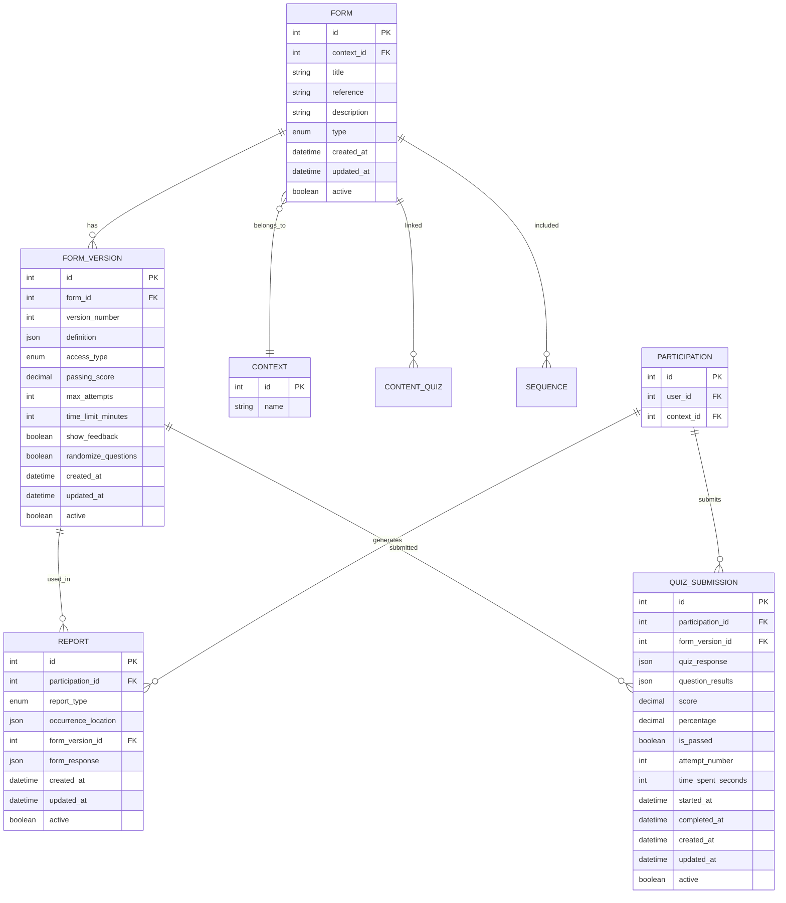

# Formulários e Relatórios

Esta seção detalha o modelo de dados relacionado a formulários, versões, relatórios e submissões de quiz.

## Diagrama



## Tabelas

### FORM

Formulários do sistema - podem ser do tipo "signal" (sinais) ou "quiz" (questionários).

| Campo | Tipo | Descrição |
|-------|------|-----------|
| `id` | INT | Identificador único (PK) |
| `context_id` | INT | Referência ao contexto (FK → context.id, opcional) |
| `title` | VARCHAR(255) | Título do formulário |
| `reference` | VARCHAR(255) | Código de referência (opcional) |
| `description` | TEXT | Descrição do formulário |
| `type` | ENUM | Tipo: `signal` ou `quiz` |
| `created_at` | TIMESTAMP | Data de criação |
| `updated_at` | TIMESTAMP | Data de última atualização |
| `active` | BOOLEAN | Status ativo/inativo |

**Enums:**
- `form_type_enum`: `signal`, `quiz`

**Índices:**
- `idx_form_context_id` (context_id)

### FORM_VERSION

Versões de formulários com definição JSON e configurações específicas para quizzes.

| Campo | Tipo | Descrição |
|-------|------|-----------|
| `id` | INT | Identificador único (PK) |
| `form_id` | INT | Referência ao formulário (FK → form.id) |
| `version_number` | INT | Número da versão |
| `definition` | JSON | Definição completa do formulário (campos, validações, etc.) |
| `access_type` | ENUM | Tipo de acesso: `PUBLIC` ou `PRIVATE` |
| `passing_score` | DECIMAL(5,2) | Nota mínima para aprovação (quizzes, opcional) |
| `max_attempts` | INT | Número máximo de tentativas (quizzes, opcional) |
| `time_limit_minutes` | INT | Limite de tempo em minutos (quizzes, opcional) |
| `show_feedback` | BOOLEAN | Mostrar feedback após resposta (default: true) |
| `randomize_questions` | BOOLEAN | Randomizar ordem das questões (default: false) |
| `created_at` | TIMESTAMP | Data de criação |
| `updated_at` | TIMESTAMP | Data de última atualização |
| `active` | BOOLEAN | Status ativo/inativo |

**Enums:**
- `form_version_access_type`: `PUBLIC`, `PRIVATE`

**Constraints:**
- UNIQUE (form_id, version_number) - Uma versão por formulário

**Índices:**
- `idx_form_version_form_id` (form_id)

### REPORT

Relatórios gerados a partir de formulários do tipo "signal".

| Campo | Tipo | Descrição |
|-------|------|-----------|
| `id` | INT | Identificador único (PK) |
| `participation_id` | INT | Referência à participação (FK → participation.id) |
| `report_type` | ENUM | Tipo: `POSITIVE` ou `NEGATIVE` |
| `occurrence_location` | JSON | Localização da ocorrência (coordenadas, endereço, etc.) |
| `form_version_id` | INT | Referência à versão do formulário usada (FK → form_version.id) |
| `form_response` | JSON | Respostas do formulário |
| `created_at` | TIMESTAMP | Data de criação |
| `updated_at` | TIMESTAMP | Data de última atualização |
| `active` | BOOLEAN | Status ativo/inativo |

**Enums:**
- `report_type_enum`: `POSITIVE`, `NEGATIVE`

**Índices:**
- `idx_report_form_version_id` (form_version_id)
- `idx_report_participation_id` (participation_id)

### QUIZ_SUBMISSION

Submissões de quizzes com pontuação e resultados detalhados.

| Campo | Tipo | Descrição |
|-------|------|-----------|
| `id` | INT | Identificador único (PK) |
| `participation_id` | INT | Referência à participação (FK → participation.id) |
| `form_version_id` | INT | Referência à versão do quiz (FK → form_version.id) |
| `quiz_response` | JSON | Respostas do quiz |
| `question_results` | JSON | Resultados detalhados por questão: `[{questionName, isCorrect, pointsEarned, userAnswer, correctAnswer, feedback}]` |
| `score` | DECIMAL(5,2) | Pontuação obtida |
| `percentage` | DECIMAL(5,2) | Percentual de acerto |
| `is_passed` | BOOLEAN | Se passou no quiz (baseado em passing_score) |
| `attempt_number` | INT | Número da tentativa |
| `time_spent_seconds` | INT | Tempo gasto em segundos |
| `started_at` | TIMESTAMP | Data/hora de início |
| `completed_at` | TIMESTAMP | Data/hora de conclusão (opcional) |
| `created_at` | TIMESTAMP | Data de criação |
| `updated_at` | TIMESTAMP | Data de última atualização |
| `active` | BOOLEAN | Status ativo/inativo |

**Índices:**
- `idx_quiz_submission_participation_id` (participation_id)
- `idx_quiz_submission_form_version_id` (form_version_id)
- `idx_quiz_submission_score` (score)
- `idx_quiz_submission_is_passed` (is_passed)
- `idx_quiz_submission_attempt` (participation_id, form_version_id, attempt_number)
- `idx_quiz_submission_completed_at` (completed_at)

## Relacionamentos

1. **FORM → CONTEXT**: Um formulário pode pertencer a um contexto (opcional)
2. **FORM → FORM_VERSION**: Um formulário pode ter múltiplas versões
3. **FORM_VERSION → REPORT**: Uma versão pode ser usada em múltiplos relatórios
4. **FORM_VERSION → QUIZ_SUBMISSION**: Uma versão pode ter múltiplas submissões
5. **PARTICIPATION → REPORT**: Uma participação pode gerar múltiplos relatórios
6. **PARTICIPATION → QUIZ_SUBMISSION**: Uma participação pode ter múltiplas submissões de quiz
7. **FORM → CONTENT_QUIZ**: Um formulário (quiz) pode estar associado a conteúdos
8. **FORM → SEQUENCE**: Um formulário pode ser incluído em sequências de trilhas

## Tipos de Formulários

### Signal (Sinais)

Formulários para registro de ocorrências/sinais:
- Geram **REPORT** após submissão
- Não têm pontuação
- Focam em coleta de dados e relatórios

### Quiz (Questionários)

Formulários de avaliação com pontuação:
- Geram **QUIZ_SUBMISSION** após submissão
- Têm pontuação e percentual de acerto
- Podem ter nota mínima para aprovação
- Suportam múltiplas tentativas
- Podem ter limite de tempo

## Regras de Negócio

### Formulários

- Um formulário pode ter múltiplas versões
- Cada versão tem um número único por formulário
- A definição do formulário é armazenada em JSON na versão
- Ao excluir um formulário, todas as versões são excluídas (CASCADE)

### Versões de Formulário

- Versões `PUBLIC` são acessíveis a todos
- Versões `PRIVATE` são acessíveis apenas a participantes do contexto
- Configurações de quiz (passing_score, max_attempts, etc.) são opcionais
- Ao excluir uma versão, relatórios e submissões são mantidos (RESTRICT)

### Relatórios

- Relatórios são gerados apenas de formulários tipo "signal"
- Um relatório está vinculado a uma participação específica
- O campo `occurrence_location` armazena dados geográficos da ocorrência
- O campo `form_response` armazena todas as respostas do formulário
- Ao excluir uma participação, seus relatórios são excluídos (CASCADE)

### Submissões de Quiz

- Submissões são geradas apenas de formulários tipo "quiz"
- Uma submissão está vinculada a uma participação específica
- O campo `question_results` armazena análise detalhada por questão
- O sistema controla número de tentativas baseado em `max_attempts`
- O campo `is_passed` é calculado baseado em `passing_score`
- Ao excluir uma participação, suas submissões são excluídas (CASCADE)

## Consultas Comuns

### Buscar última versão ativa de um formulário

```sql
SELECT * FROM form_version
WHERE form_id = ?
  AND active = true
ORDER BY version_number DESC
LIMIT 1;
```

### Listar relatórios de um contexto

```sql
SELECT r.*, p.user_id, fv.form_id, f.title as form_title
FROM report r
INNER JOIN participation p ON r.participation_id = p.id
INNER JOIN form_version fv ON r.form_version_id = fv.id
INNER JOIN form f ON fv.form_id = f.id
WHERE p.context_id = ?
  AND r.active = true
ORDER BY r.created_at DESC;
```

### Buscar submissões de quiz de um usuário

```sql
SELECT qs.*, f.title as quiz_title, fv.version_number
FROM quiz_submission qs
INNER JOIN form_version fv ON qs.form_version_id = fv.id
INNER JOIN form f ON fv.form_id = f.id
INNER JOIN participation p ON qs.participation_id = p.id
WHERE p.user_id = ?
  AND qs.active = true
ORDER BY qs.completed_at DESC;
```

### Verificar se usuário pode fazer nova tentativa de quiz

```sql
SELECT 
  COUNT(*) as attempts,
  fv.max_attempts,
  CASE 
    WHEN COUNT(*) < fv.max_attempts OR fv.max_attempts IS NULL 
    THEN true 
    ELSE false 
  END as can_attempt
FROM quiz_submission qs
INNER JOIN form_version fv ON qs.form_version_id = fv.id
INNER JOIN participation p ON qs.participation_id = p.id
WHERE p.user_id = ?
  AND fv.id = ?
  AND qs.active = true
GROUP BY fv.max_attempts;
```
