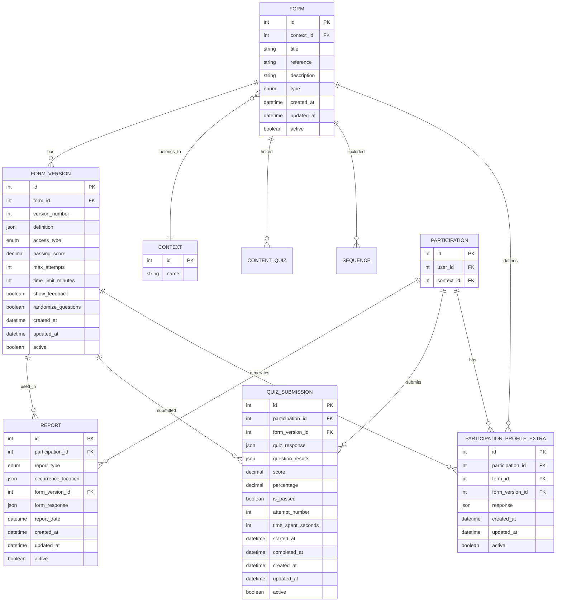

# Formulários e Relatórios

Esta seção detalha o modelo de dados relacionado a formulários, versões, relatórios e submissões de quiz.

## Diagrama


```mermaid
erDiagram
    FORM ||--o{ FORM_VERSION : "has"
    FORM }o--|| CONTEXT : "belongs_to"
    FORM ||--o{ CONTENT_QUIZ : "linked"
    FORM ||--o{ SEQUENCE : "included"
    
    FORM_VERSION ||--o{ REPORT : "used_in"
    FORM_VERSION ||--o{ QUIZ_SUBMISSION : "submitted"
    
    PARTICIPATION ||--o{ REPORT : "generates"
    PARTICIPATION ||--o{ QUIZ_SUBMISSION : "submits"
    PARTICIPATION ||--o{ PARTICIPATION_PROFILE_EXTRA : "has"
    FORM ||--o{ PARTICIPATION_PROFILE_EXTRA : "defines"
    FORM_VERSION ||--o{ PARTICIPATION_PROFILE_EXTRA : "submitted_as"
    
    FORM {
        int id PK
        int context_id FK
        string title
        string reference
        string description
        enum type
        datetime created_at
        datetime updated_at
        boolean active
    }
    
    FORM_VERSION {
        int id PK
        int form_id FK
        int version_number
        json definition
        enum access_type
        decimal passing_score
        int max_attempts
        int time_limit_minutes
        boolean show_feedback
        boolean randomize_questions
        datetime created_at
        datetime updated_at
        boolean active
    }
    
    REPORT {
        int id PK
        int participation_id FK
        enum report_type
        json occurrence_location
        int form_version_id FK
        json form_response
        datetime report_date
        datetime created_at
        datetime updated_at
        boolean active
    }
    
    QUIZ_SUBMISSION {
        int id PK
        int participation_id FK
        int form_version_id FK
        json quiz_response
        json question_results
        decimal score
        decimal percentage
        boolean is_passed
        int attempt_number
        int time_spent_seconds
        datetime started_at
        datetime completed_at
        datetime created_at
        datetime updated_at
        boolean active
    }
    
    PARTICIPATION_PROFILE_EXTRA {
        int id PK
        int participation_id FK
        int form_id FK
        int form_version_id FK
        json response
        datetime created_at
        datetime updated_at
        boolean active
    }
    
    CONTEXT {
        int id PK
        string name
    }
    
    PARTICIPATION {
        int id PK
        int user_id FK
        int context_id FK
    }
```

## Tabelas

### FORM

Formulários do sistema - podem ser do tipo "signal" (sinais), "quiz" (questionários) ou **"profile_extra"** (dados adicionais de perfil por contexto).

| Campo | Tipo | Descrição |
|-------|------|-----------|
| `id` | INT | Identificador único (PK) |
| `context_id` | INT | Referência ao contexto (FK → context.id, opcional) |
| `title` | VARCHAR(255) | Título do formulário |
| `reference` | VARCHAR(255) | Código de referência (opcional) |
| `description` | TEXT | Descrição do formulário |
| `type` | ENUM | Tipo: `signal`, `quiz` ou `profile_extra` |
| `created_at` | TIMESTAMP | Data de criação |
| `updated_at` | TIMESTAMP | Data de última atualização |
| `active` | BOOLEAN | Status ativo/inativo |

**Enums:**
- `form_type_enum`: `signal`, `quiz`, `profile_extra`

**Índices:**
- `idx_form_context_id` (context_id)

### FORM_VERSION

Versões de formulários com definição JSON e configurações específicas para quizzes.

| Campo | Tipo | Descrição |
|-------|------|-----------|
| `id` | INT | Identificador único (PK) |
| `form_id` | INT | Referência ao formulário (FK → form.id) |
| `version_number` | INT | Número da versão |
| `definition` | JSON | Definição completa do formulário (campos, validações, etc.) |
| `access_type` | ENUM | Tipo de acesso: `PUBLIC` ou `PRIVATE` |
| `passing_score` | DECIMAL(5,2) | Nota mínima para aprovação (quizzes, opcional) |
| `max_attempts` | INT | Número máximo de tentativas (quizzes, opcional) |
| `time_limit_minutes` | INT | Limite de tempo em minutos (quizzes, opcional) |
| `show_feedback` | BOOLEAN | Mostrar feedback após resposta (default: true) |
| `randomize_questions` | BOOLEAN | Randomizar ordem das questões (default: false) |
| `created_at` | TIMESTAMP | Data de criação |
| `updated_at` | TIMESTAMP | Data de última atualização |
| `active` | BOOLEAN | Status ativo/inativo |

**Enums:**
- `form_version_access_type`: `PUBLIC`, `PRIVATE`

**Constraints:**
- UNIQUE (form_id, version_number) - Uma versão por formulário

**Índices:**
- `idx_form_version_form_id` (form_id)

### REPORT

Relatórios gerados a partir de formulários do tipo "signal".

| Campo | Tipo | Descrição |
|-------|------|-----------|
| `id` | INT | Identificador único (PK) |
| `participation_id` | INT | Referência à participação (FK → participation.id) |
| `report_type` | ENUM | Tipo: `POSITIVE` ou `NEGATIVE` |
| `occurrence_location` | JSON | Localização da ocorrência (coordenadas, endereço, etc.) |
| `form_version_id` | INT | Referência à versão do formulário usada (FK → form_version.id) |
| `form_response` | JSON | Respostas do formulário |
| `report_date` | TIMESTAMP | Momento em que o participante fez o reporte **no aparelho**. No reporte offline é anterior ao `created_at`; no online, igual a ele. Ver [Data do reporte e reporte offline](#data-do-reporte-e-reporte-offline) — migração **`V43__report_report_date.sql`** |
| `created_at` | TIMESTAMP | Momento em que o registro foi **gravado no backend** |
| `updated_at` | TIMESTAMP | Data de última atualização |
| `active` | BOOLEAN | Status ativo/inativo |

**Enums:**
- `report_type_enum`: `POSITIVE` (benigno: "BEM", "Nada ocorreu"), `NEGATIVE` (alerta: "MAL", "Informar")

**Índices:**
- `idx_report_form_version_id` (form_version_id)
- `idx_report_participation_id` (participation_id)
- `idx_report_points_map` (parcial: reports ativos com `occurrence_location`, por `created_at`) — migração **`V20__idx_report_points_map.sql`**
- `idx_report_participation_type_active_report_date_desc` (participation_id, report_type, active, report_date DESC) — idempotência na criação; migração **`V43__report_report_date.sql`**
- `idx_report_participation_type_active_created_desc` (mesma ideia por `created_at`) — **`V29__report_idempotency_indexes.sql`**; deixa de ser usado pela idempotência a partir do V43 e fica até listagem e mapa migrarem para `report_date`

:::tip Classificação sindrômica

A partir das respostas em `form_response`, o backend pode calcular scores por síndrome e persistir em `report_syndrome_score`, com configuração por `form` e catálogos de sintomas/síndromes. Documentação completa: [Classificação sindrômica](classificacao-sindromica).

:::

### QUIZ_SUBMISSION

Submissões de quizzes com pontuação e resultados detalhados.

| Campo | Tipo | Descrição |
|-------|------|-----------|
| `id` | INT | Identificador único (PK) |
| `participation_id` | INT | Referência à participação (FK → participation.id) |
| `form_version_id` | INT | Referência à versão do quiz (FK → form_version.id) |
| `quiz_response` | JSON | Respostas do quiz |
| `question_results` | JSON | Resultados detalhados por questão: `[{questionName, isCorrect, pointsEarned, userAnswer, correctAnswer, feedback}]` |
| `score` | DECIMAL(5,2) | Pontuação obtida |
| `percentage` | DECIMAL(5,2) | Percentual de acerto |
| `is_passed` | BOOLEAN | Se passou no quiz (baseado em passing_score) |
| `attempt_number` | INT | Número da tentativa |
| `time_spent_seconds` | INT | Tempo gasto em segundos |
| `started_at` | TIMESTAMP | Data/hora de início |
| `completed_at` | TIMESTAMP | Data/hora de conclusão (opcional) |
| `created_at` | TIMESTAMP | Data de criação |
| `updated_at` | TIMESTAMP | Data de última atualização |
| `active` | BOOLEAN | Status ativo/inativo |

**Índices:**
- `idx_quiz_submission_participation_id` (participation_id)
- `idx_quiz_submission_form_version_id` (form_version_id)
- `idx_quiz_submission_score` (score)
- `idx_quiz_submission_is_passed` (is_passed)
- `idx_quiz_submission_attempt` (participation_id, form_version_id, attempt_number)
- `idx_quiz_submission_completed_at` (completed_at)

### PARTICIPATION_PROFILE_EXTRA {#participation_profile_extra}

Respostas do formulário tipo **`profile_extra`**, **por participação** e **por formulário** (uma linha ativa por par `participation_id` + `form_id`). Usado para campos de perfil configuráveis que dependem do **contexto** da participação ativa do usuário.

| Campo | Tipo | Descrição |
|-------|------|-----------|
| `id` | INT | Identificador único (PK) |
| `participation_id` | INT | Referência à participação (FK → participation.id) |
| `form_id` | INT | Referência ao formulário (FK → form.id), tipo `profile_extra` |
| `form_version_id` | INT | Versão utilizada na submissão (FK → form_version.id, RESTRICT) |
| `response` | JSONB | Respostas (mapa alinhado aos `name` dos campos em `definition`) |
| `created_at` | TIMESTAMP | Data de criação |
| `updated_at` | TIMESTAMP | Data de última atualização |
| `active` | BOOLEAN | Status ativo/inativo |

**Constraints:**
- UNIQUE (`participation_id`, `form_id`)

**Índices:**
- `idx_participation_profile_extra_participation_id` (`participation_id`)

Fluxo e endpoints REST para aplicativos: [Dados adicionais de perfil](dados-adicionais-perfil).

## Relacionamentos

1. **FORM → CONTEXT**: Um formulário pode pertencer a um contexto (opcional)
2. **FORM → FORM_VERSION**: Um formulário pode ter múltiplas versões
3. **FORM_VERSION → REPORT**: Uma versão pode ser usada em múltiplos relatórios
4. **FORM_VERSION → QUIZ_SUBMISSION**: Uma versão pode ter múltiplas submissões
5. **PARTICIPATION → REPORT**: Uma participação pode gerar múltiplos relatórios
6. **PARTICIPATION → QUIZ_SUBMISSION**: Uma participação pode ter múltiplas submissões de quiz
7. **PARTICIPATION → PARTICIPATION_PROFILE_EXTRA**: Uma participação pode ter até uma submissão ativa por formulário `profile_extra` (constraint única)
8. **FORM / FORM_VERSION → PARTICIPATION_PROFILE_EXTRA**: Define qual formulário e versão foram respondidos
9. **FORM → CONTENT_QUIZ**: Um formulário (quiz) pode estar associado a conteúdos
10. **FORM → SEQUENCE**: Um formulário pode ser incluído em sequências de trilhas

## Tipos de Formulários

### Signal (Sinais)

Formulários para registro de ocorrências/sinais:
- Geram **REPORT** após submissão
- Não têm pontuação
- Focam em coleta de dados e relatórios

### Quiz (Questionários)

Formulários de avaliação com pontuação:
- Geram **QUIZ_SUBMISSION** após submissão
- Têm pontuação e percentual de acerto
- Podem ter nota mínima para aprovação
- Suportam múltiplas tentativas
- Podem ter limite de tempo

### Profile extra (Dados adicionais de perfil)

Formulários **por contexto** para campos extras de perfil do cidadão:
- **Não** geram `report` nem `quiz_submission`
- Persistem em **PARTICIPATION_PROFILE_EXTRA** (upsert via API `PUT /v1/participation-profile-extra/me`)
- A versão ativa mais recente com `definition.fields` não vazio define o que o app deve coletir; ver [Dados adicionais de perfil](dados-adicionais-perfil)

## Regras de Negócio

### Formulários

- Um formulário pode ter múltiplas versões
- Cada versão tem um número único por formulário
- A definição do formulário é armazenada em JSON na versão
- Ao excluir um formulário, todas as versões são excluídas (CASCADE)

### Versões de Formulário

- Versões `PUBLIC` são acessíveis a todos
- Versões `PRIVATE` são acessíveis apenas a participantes do contexto
- Configurações de quiz (passing_score, max_attempts, etc.) são opcionais
- Ao excluir uma versão, relatórios e submissões são mantidos (RESTRICT)

### Relatórios

- Relatórios são gerados apenas de formulários tipo "signal"
- Um relatório está vinculado a uma participação específica
- O campo `occurrence_location` armazena dados geográficos da ocorrência
- O campo `form_response` armazena todas as respostas do formulário
- Ao excluir uma participação, seus relatórios são excluídos (CASCADE)
- **`GET /v1/reports/points`**: devolve latitude/longitude/tipo para mapas; `limit` padrão 500; ver [Performance da API](/desenvolvimento-performance-api)
- **Agregados de calendário/ofensiva**: tabelas `participation_report_day` e `participation_report_streak` (**`V18__report_streaks.sql`**) atualizadas por incremento ao criar report, pelo dia civil de **`report_date`** em `America/Sao_Paulo`
- **Idempotência / anti-abuso**: janelas por contexto em `context_configuration` (ver [Configuração de contexto](/arquitetura/configuracao-contexto-e-integracoes)), contadas a partir do `report_date` do report novo

### Data do reporte e reporte offline

O app pode guardar reportes sem conexão e enviá-los depois, às vezes vários de uma vez. Por isso o report tem duas datas:

| Campo | Significa | Quem define |
|-------|-----------|-------------|
| `report_date` (API: `reportDate`) | quando o participante reportou | o app, no `POST /v1/reports` |
| `created_at` (API: `createdAt`) | quando o backend gravou | o banco |

**Entrada (`POST /v1/reports`).** `reportDate` é **opcional**, em ISO 8601 **com hora e fuso** (`2026-10-08T14:30:00-03:00` ou `...Z`). Só a data (`2026-10-08`) ou hora sem fuso são recusadas com 400: viraria meia-noite UTC, que em Brasília é o dia anterior. Sem o campo, o banco aplica o default e `report_date` fica igual ao `created_at` — versões do app que não mandam o campo continuam funcionando.

**Relógio do aparelho errado.** Um `reportDate` mais de 5 minutos no futuro, ou anterior à criação da participação (menos 1 dia de folga), é **substituído pelo horário do servidor**, com aviso no log (`reportDate fora do intervalo plausível`). O report não é recusado: recusar faria a fila offline do app reenviar o mesmo report para sempre.

**Saída.** `reportDate` aparece em toda resposta de report (`POST`, `GET /v1/reports`, `GET /v1/reports/:id`, `PATCH`), ao lado de `createdAt`.

**Idempotência.** Com as janelas de `context_configuration` (padrão 60 min), contadas a partir do `report_date` do report novo, não do relógio do servidor:

- *Mesmo tipo a até a janela, antes ou depois* (`negative_report_dedup_window_min`): é reenvio — o backend responde com o report já existente e não grava outro. "Antes ou depois" porque o lote offline pode chegar fora de ordem.
- *Benigno (`POSITIVE`) feito até a janela **depois** de um alerta (`NEGATIVE`)* (`negative_block_if_positive_within_min`): o benigno é ignorado para não encobrir o alerta. Um benigno feito **antes** do alerta é gravado normalmente, mesmo que chegue depois dele.

Antes do V43 as janelas contavam a partir da chegada ao servidor. Num lote offline todos os reports chegam juntos, então reports de **dias diferentes** caíam na mesma janela e eram descartados como duplicados — sem erro para o app, que recebia o report antigo como se fosse o novo.

**Ofensiva e dias reportados.** O dia civil vem do `report_date`. Quando chega um dia **anterior** ao último registrado (offline), a ofensiva é recalculada a partir de `participation_report_day`; a maior ofensiva nunca diminui. Antes, esse caso zerava a ofensiva atual e fazia `last_reported_date` voltar no tempo.

:::note Ainda por `created_at`
Listagem (`GET /v1/reports`, filtros `startDate`/`endDate` e ordenação), mapa de pontos (`GET /v1/reports/points`, janela de 7 dias) e as visões de BI continuam usando `created_at`. A migração deles para `report_date` é uma etapa separada, por envolver índices sensíveis a desempenho (`V20`).
:::

### Submissões de Quiz

- Submissões são geradas apenas de formulários tipo "quiz"
- Uma submissão está vinculada a uma participação específica
- O campo `question_results` armazena análise detalhada por questão
- O sistema controla número de tentativas baseado em `max_attempts`
- O campo `is_passed` é calculado baseado em `passing_score`
- Ao excluir uma participação, suas submissões são excluídas (CASCADE)

### Dados adicionais de perfil (`profile_extra`)

- Um contexto pode ter um ou mais formulários `profile_extra` ativos; a API do participante usa **um** por vez (menor `id` do formulário)
- A completude do perfil (incluindo bloqueio no app) combina perfil base do usuário + alinhamento da submissão à **versão atual** do formulário
- Exclusão da participação remove registros em `participation_profile_extra` (CASCADE)

## Consultas Comuns

### Buscar última versão ativa de um formulário

```sql
SELECT * FROM form_version
WHERE form_id = ?
  AND active = true
ORDER BY version_number DESC
LIMIT 1;
```

### Listar relatórios de um contexto

```sql
SELECT r.*, p.user_id, fv.form_id, f.title as form_title
FROM report r
INNER JOIN participation p ON r.participation_id = p.id
INNER JOIN form_version fv ON r.form_version_id = fv.id
INNER JOIN form f ON fv.form_id = f.id
WHERE p.context_id = ?
  AND r.active = true
ORDER BY r.created_at DESC;
```

### Buscar submissões de quiz de um usuário

```sql
SELECT qs.*, f.title as quiz_title, fv.version_number
FROM quiz_submission qs
INNER JOIN form_version fv ON qs.form_version_id = fv.id
INNER JOIN form f ON fv.form_id = f.id
INNER JOIN participation p ON qs.participation_id = p.id
WHERE p.user_id = ?
  AND qs.active = true
ORDER BY qs.completed_at DESC;
```

### Verificar se usuário pode fazer nova tentativa de quiz

```sql
SELECT 
  COUNT(*) as attempts,
  fv.max_attempts,
  CASE 
    WHEN COUNT(*) < fv.max_attempts OR fv.max_attempts IS NULL 
    THEN true 
    ELSE false 
  END as can_attempt
FROM quiz_submission qs
INNER JOIN form_version fv ON qs.form_version_id = fv.id
INNER JOIN participation p ON qs.participation_id = p.id
WHERE p.user_id = ?
  AND fv.id = ?
  AND qs.active = true
GROUP BY fv.max_attempts;
```
