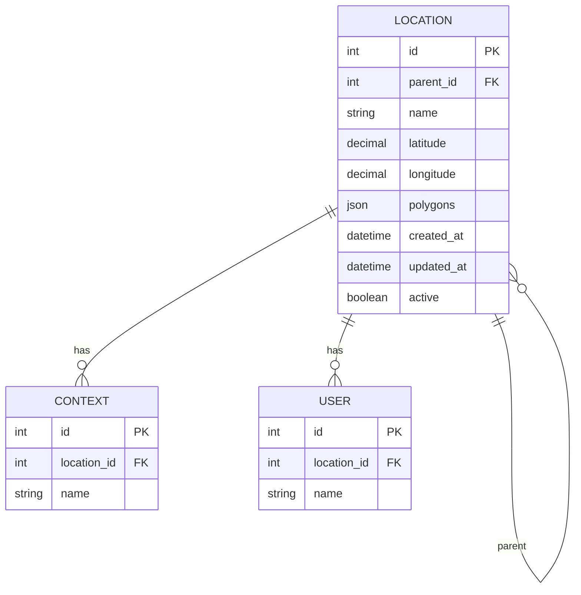

# Localização

Esta seção detalha o modelo de dados relacionado a localizações geográficas e hierarquias.

## Diagrama



## Tabela LOCATION

Armazena informações de localizações geográficas com suporte a hierarquia e polígonos.

| Campo | Tipo | Descrição |
|-------|------|-----------|
| `id` | INT | Identificador único (PK) |
| `parent_id` | INT | Referência à localização pai (FK → location.id, auto-relacionamento) |
| `name` | VARCHAR(255) | Nome da localização |
| `latitude` | DECIMAL(10,8) | Latitude (opcional) |
| `longitude` | DECIMAL(11,8) | Longitude (opcional) |
| `polygons` | JSONB | Polígonos GeoJSON para delimitação de áreas (opcional) |
| `created_at` | TIMESTAMP | Data de criação |
| `updated_at` | TIMESTAMP | Data de última atualização |
| `active` | BOOLEAN | Status ativo/inativo |

**Índices:**
- `idx_location_parent_id` (parent_id)

## Hierarquia de Localizações

A tabela `location` possui um **auto-relacionamento** através do campo `parent_id`, permitindo criar uma hierarquia de localizações:

- **Nível 1**: País (ex: Brasil)
- **Nível 2**: Estado/Região (ex: Distrito Federal)
- **Nível 3**: Cidade/Município (ex: Brasília)
- **Níveis adicionais**: Bairros, zonas, etc.

### Exemplo de Hierarquia

```
Brasil (parent_id: NULL)
  └── Distrito Federal (parent_id: 1)
      └── Brasília (parent_id: 2)
          └── Asa Norte (parent_id: 3)
          └── Asa Sul (parent_id: 3)
```

## Coordenadas Geográficas

- **latitude**: Coordenada de latitude (formato: -15.7801)
- **longitude**: Coordenada de longitude (formato: -47.9292)

Usado para localização pontual de uma localização no mapa.

## Polígonos (GeoJSON)

O campo `polygons` armazena dados no formato GeoJSON para representar áreas delimitadas:

```json
{
  "type": "Polygon",
  "coordinates": [[
    [-47.9292, -15.7801],
    [-47.9200, -15.7801],
    [-47.9200, -15.7700],
    [-47.9292, -15.7700],
    [-47.9292, -15.7801]
  ]]
}
```

Permite:
- Delimitar áreas geográficas complexas
- Verificar se um ponto está dentro de uma área
- Visualizar fronteiras no mapa

## Relacionamentos

1. **LOCATION → LOCATION** (parent): Hierarquia de localizações
   - Uma localização pode ter uma localização pai
   - Uma localização pode ter múltiplas localizações filhas
   - Permite navegação até 3 níveis (parent → parent → parent)

2. **LOCATION → CONTEXT**: Uma localização pode ter múltiplos contextos associados

3. **LOCATION → USER**: Uma localização pode ter múltiplos usuários associados

## Regras de Negócio

- Uma localização pode não ter `parent_id` (é uma localização raiz)
- Ao excluir uma localização pai, o `parent_id` das filhas é definido como `NULL` (ON DELETE SET NULL)
- Coordenadas e polígonos são opcionais
- Uma localização pode ter apenas coordenadas, apenas polígonos, ou ambos
- O sistema suporta consulta hierárquica até o terceiro nível (parent do parent)

## Consultas Comuns

### Buscar localização com hierarquia completa

```sql
SELECT 
  l.id,
  l.name,
  parent.name as parent_name,
  parent_parent.name as parent_parent_name
FROM location l
LEFT JOIN location parent ON l.parent_id = parent.id
LEFT JOIN location parent_parent ON parent.parent_id = parent_parent.id
WHERE l.id = ?
```

### Buscar todas as localizações filhas

```sql
WITH RECURSIVE location_tree AS (
  SELECT id, name, parent_id, 1 as level
  FROM location
  WHERE id = ?
  
  UNION ALL
  
  SELECT l.id, l.name, l.parent_id, lt.level + 1
  FROM location l
  INNER JOIN location_tree lt ON l.parent_id = lt.id
)
SELECT * FROM location_tree;
```
