# Modelo de Banco de Dados

Este documento apresenta o modelo completo do banco de dados do sistema GDS, incluindo todas as tabelas, relacionamentos e estruturas.

:::tip Documentação Detalhada

O diagrama completo abaixo é extenso. Para uma visão mais detalhada de cada parte do modelo, consulte os sub-tópicos:

- [Usuários e Autenticação](usuarios-autenticacao) - Usuários, gêneros e documentos legais
- [Localização](localizacao) - Hierarquia geográfica e polígonos
- [Contextos e Participação](contextos-participacao) - Contextos, gerentes e participações
- [Conteúdo e Tags](conteudo-tags) - Artigos, materiais educacionais e sistema de tags
- [Formulários e Relatórios](formularios-relatorios) - Formulários, versões, relatórios e quizzes
- [Trilhas de Aprendizado](trilhas-aprendizado) - Trilhas, seções e sequências

:::

## Diagrama Entidade-Relacionamento (ER)

```mermaid
erDiagram
    USER ||--o{ CONTENT : "author"
    USER ||--o{ CONTEXT_MANAGER : "manages"
    USER ||--o{ PARTICIPATION : "participates"
    USER ||--o{ USER_LEGAL_ACCEPTANCE : "accepts"
    USER }o--|| GENDER : "has"
    USER }o--|| LOCATION : "located_in"
    
    CONTEXT ||--o{ CONTENT : "contains"
    CONTEXT ||--o{ CONTEXT_MANAGER : "has"
    CONTEXT ||--o{ FORM : "has"
    CONTEXT ||--o{ PARTICIPATION : "has"
    CONTEXT ||--o{ TRACK : "has"
    CONTEXT }o--|| LOCATION : "located_in"
    
    LOCATION ||--o{ CONTEXT : "has"
    LOCATION ||--o{ LOCATION : "parent"
    LOCATION ||--o{ USER : "has"
    
    FORM ||--o{ FORM_VERSION : "has"
    FORM ||--o{ CONTENT_QUIZ : "linked"
    FORM ||--o{ SEQUENCE : "included"
    FORM }o--|| CONTEXT : "belongs_to"
    
    FORM_VERSION ||--o{ REPORT : "used_in"
    FORM_VERSION ||--o{ QUIZ_SUBMISSION : "submitted"
    
    PARTICIPATION ||--o{ REPORT : "generates"
    PARTICIPATION ||--o{ QUIZ_SUBMISSION : "submits"
    
    CONTENT ||--o{ CONTENT_TAG : "tagged"
    CONTENT ||--o{ CONTENT_QUIZ : "has"
    CONTENT ||--o{ SEQUENCE : "included"
    
    TAG ||--o{ CONTENT_TAG : "tags"
    
    TRACK ||--o{ SECTION : "has"
    SECTION ||--o{ SEQUENCE : "contains"
    
    SEQUENCE }o--|| CONTENT : "references"
    SEQUENCE }o--|| FORM : "references"
    
    LEGAL_DOCUMENT_TYPE ||--o{ LEGAL_DOCUMENT : "has"
    LEGAL_DOCUMENT ||--o{ USER_LEGAL_ACCEPTANCE : "accepted"
    
    USER {
        int id PK
        string name
        string email UK
        string password
        int gender_id FK
        int location_id FK
        string external_identifier
        datetime created_at
        datetime updated_at
        boolean active
    }
    
    GENDER {
        int id PK
        string name UK
        datetime created_at
        datetime updated_at
        boolean active
    }
    
    LOCATION {
        int id PK
        int parent_id FK
        string name
        decimal latitude
        decimal longitude
        json polygons
        datetime created_at
        datetime updated_at
        boolean active
    }
    
    CONTEXT {
        int id PK
        int location_id FK
        string name
        string description
        string type
        enum access_type
        datetime created_at
        datetime updated_at
        boolean active
    }
    
    CONTEXT_MANAGER {
        int id PK
        int user_id FK
        int context_id FK
        datetime created_at
        datetime updated_at
        boolean active
    }
    
    PARTICIPATION {
        int id PK
        int user_id FK
        int context_id FK
        date start_date
        date end_date
        boolean active
        datetime created_at
        datetime updated_at
    }
    
    CONTENT {
        int id PK
        string title
        string reference UK
        text content
        boolean active
        string summary
        string slug UK
        int author_id FK
        int context_id FK
        datetime created_at
        datetime updated_at
        datetime published_at
    }
    
    TAG {
        int id PK
        string name UK
        string color
        string description
        datetime created_at
        datetime updated_at
        boolean active
    }
    
    CONTENT_TAG {
        int id PK
        int content_id FK
        int tag_id FK
        datetime created_at
        datetime updated_at
        boolean active
    }
    
    FORM {
        int id PK
        int context_id FK
        string title
        string reference
        string description
        enum type
        datetime created_at
        datetime updated_at
        boolean active
    }
    
    FORM_VERSION {
        int id PK
        int form_id FK
        int version_number
        json definition
        enum access_type
        decimal passing_score
        int max_attempts
        int time_limit_minutes
        boolean show_feedback
        boolean randomize_questions
        datetime created_at
        datetime updated_at
        boolean active
    }
    
    REPORT {
        int id PK
        int participation_id FK
        enum report_type
        json occurrence_location
        int form_version_id FK
        json form_response
        datetime created_at
        datetime updated_at
        boolean active
    }
    
    TRACK {
        int id PK
        string name
        string description
        int context_id FK
        boolean control_period
        date start_date
        date end_date
        boolean show_after_completion
        datetime created_at
        datetime updated_at
        boolean active
    }
    
    SECTION {
        int id PK
        int track_id FK
        string name
        int order
        datetime created_at
        datetime updated_at
        boolean active
    }
    
    SEQUENCE {
        int id PK
        int section_id FK
        int content_id FK
        int form_id FK
        int order
        datetime created_at
        datetime updated_at
        boolean active
    }
    
    CONTENT_QUIZ {
        int id PK
        int content_id FK
        int form_id FK
        int display_order
        boolean is_required
        decimal weight
        datetime created_at
        datetime updated_at
        boolean active
    }
    
    QUIZ_SUBMISSION {
        int id PK
        int participation_id FK
        int form_version_id FK
        json quiz_response
        json question_results
        decimal score
        decimal percentage
        boolean is_passed
        int attempt_number
        int time_spent_seconds
        datetime started_at
        datetime completed_at
        datetime created_at
        datetime updated_at
        boolean active
    }
    
    LEGAL_DOCUMENT_TYPE {
        int id PK
        string code UK
        string name
        string description
        boolean is_required
        datetime created_at
        datetime updated_at
        boolean active
    }
    
    LEGAL_DOCUMENT {
        int id PK
        int type_id FK
        string version
        string title
        text content
        date effective_date
        datetime created_at
        datetime updated_at
        boolean active
    }
    
    USER_LEGAL_ACCEPTANCE {
        int id PK
        int user_id FK
        int legal_document_id FK
        datetime accepted_at
        string ip_address
        string user_agent
    }
```

## Principais Entidades

### Usuários e Autenticação

- **USER**: Usuários do sistema com informações de perfil, localização e gênero
- **GENDER**: Tabela de gêneros (tabela básica)
- **USER_LEGAL_ACCEPTANCE**: Registro de aceitação de documentos legais pelos usuários

### Localização

- **LOCATION**: Hierarquia de localizações (auto-relacionamento via `parent_id`)
  - Suporta coordenadas geográficas (latitude/longitude)
  - Suporta polígonos (JSON) para delimitação de áreas

### Contextos e Participação

- **CONTEXT**: Contextos de trabalho/comunidade vinculados a localizações
- **CONTEXT_MANAGER**: Gerentes de contexto (relação N:N entre USER e CONTEXT)
- **PARTICIPATION**: Participação de usuários em contextos com período de vigência

### Conteúdo

- **CONTENT**: Artigos/conteúdos educacionais com versionamento
- **TAG**: Tags para categorização
- **CONTENT_TAG**: Relação N:N entre conteúdo e tags

### Formulários e Relatórios

- **FORM**: Formulários do tipo "signal" (sinais) ou "quiz" (questionários)
- **FORM_VERSION**: Versões de formulários com definição JSON e configurações de quiz
- **REPORT**: Relatórios gerados a partir de formulários do tipo "signal"
- **QUIZ_SUBMISSION**: Submissões de quizzes com pontuação e resultados detalhados

### Trilhas de Aprendizado

- **TRACK**: Trilhas de aprendizado vinculadas a contextos
- **SECTION**: Seções dentro de trilhas
- **SEQUENCE**: Sequências que podem conter conteúdo ou quiz
- **CONTENT_QUIZ**: Quizzes vinculados a conteúdos específicos

### Documentos Legais

- **LEGAL_DOCUMENT_TYPE**: Tipos de documentos legais (tabela básica)
- **LEGAL_DOCUMENT**: Versões de documentos legais

## Enums

- **context_access_type**: `PUBLIC`, `PRIVATE`
- **form_type_enum**: `signal`, `quiz`
- **form_version_access_type**: `PUBLIC`, `PRIVATE`
- **report_type_enum**: `POSITIVE`, `NEGATIVE`

## Relacionamentos Principais

1. **Hierarquia de Localizações**: `LOCATION` → `LOCATION` (auto-relacionamento)
2. **Usuário → Contexto**: Via `PARTICIPATION` e `CONTEXT_MANAGER`
3. **Formulários → Relatórios**: Via `FORM_VERSION` → `REPORT`
4. **Trilhas**: `TRACK` → `SECTION` → `SEQUENCE` → (`CONTENT` ou `FORM`)
5. **Conteúdo → Quiz**: Via `CONTENT_QUIZ` (N:N)

## Índices e Performance

O banco de dados possui índices estratégicos em:
- Chaves estrangeiras
- Campos de busca frequente (email, slug, reference)
- Campos de filtro (active, created_at)
- Combinações únicas (user_id + context_id, content_id + tag_id, etc.)
