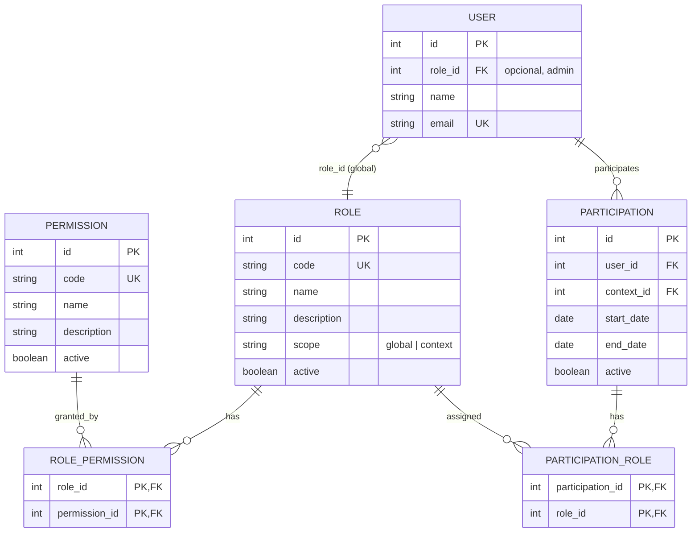

# Papéis e Permissões (RBAC)

O sistema utiliza um modelo **RBAC (Role-Based Access Control)** para controle de acesso unificado. Papéis globais (ex.: administrador) e papéis por contexto (gerente, gerente de conteúdo, participante) são definidos em banco e aplicados via Guards no backend NestJS.

## Visão geral

| Papel | Escopo | Onde fica | Uso |
|-------|--------|-----------|-----|
| **admin** | Global | `user.role_id` | Acesso total ao sistema; bypass em checagens por contexto |
| **manager** | Contexto | `participation_role` | Gerencia o contexto (managers, trilhas, participações, conteúdo, formulários) |
| **content_manager** | Contexto | `participation_role` | Gerencia apenas conteúdo e content-types no contexto |
| **participant** | Contexto | `participation_role` | Participante do contexto (leitura de conteúdo, envio de formulários, progresso em trilhas) |

Todo usuário com vínculo a um contexto possui **uma** participação (`participation`) e pode ter **uma ou mais** funções nessa participação via `participation_role`. O papel global `admin` é opcional e armazenado em `user.role_id`.

## Diagrama (RBAC)

## Tabelas

### ROLE

Papéis do sistema. O campo `scope` indica se o papel é global (`global`) ou por contexto (`context`).

| Campo | Tipo | Descrição |
|-------|------|-----------|
| `id` | INT | PK |
| `code` | VARCHAR(50) | Código único: `admin`, `manager`, `content_manager`, `participant` |
| `name` | VARCHAR(100) | Nome para exibição |
| `description` | VARCHAR(255) | Opcional |
| `scope` | VARCHAR(20) | `global` ou `context` |
| `created_at` | TIMESTAMP | |
| `updated_at` | TIMESTAMP | |
| `active` | BOOLEAN | |

**Papéis iniciais (seed):**

| code | scope | Descrição |
|------|-------|-----------|
| admin | global | Superadmin com acesso total |
| manager | context | Gerencia o contexto inteiro |
| content_manager | context | Gerencia conteúdo e content-types no contexto |
| participant | context | Participante (leitura, formulários, trilhas) |

### PERMISSION

Permissões atômicas referenciadas pelos papéis.

| Campo | Tipo | Descrição |
|-------|------|-----------|
| `id` | INT | PK |
| `code` | VARCHAR(100) | Código único (ex.: `content:read`, `content-type:manage`) |
| `name` | VARCHAR(255) | Nome para exibição |
| `description` | VARCHAR(255) | Opcional |
| `created_at` | TIMESTAMP | |
| `updated_at` | TIMESTAMP | |
| `active` | BOOLEAN | |

**Permissões iniciais (exemplos):** `system:admin`, `content:read`, `content:write`, `content-type:manage`, `managers:manage`, `participations:manage`, `tracks:manage`, `forms:manage`.

### ROLE_PERMISSION

Associação N:N entre papel e permissão. PK composta: `(role_id, permission_id)`.

### PARTICIPATION_ROLE

Associação entre participação e papel. Um mesmo usuário pode ter vários papéis no mesmo contexto (várias linhas para a mesma `participation_id`). PK composta: `(participation_id, role_id)`.

| Campo | Tipo | Descrição |
|-------|------|-----------|
| `participation_id` | INT | FK → participation.id |
| `role_id` | INT | FK → role.id |

### USER.role_id

Campo opcional em `user`. Quando preenchido com o id do papel `admin`, o usuário é administrador global e ignora restrições por contexto nas checagens de autorização.

## Regras de autorização

- **Admin (global):** `user.role?.code === 'admin'` → pode tudo (ou permissões de sistema).
- **Manager / content_manager (contexto):** o Guard obtém `context_id` (rota ou body), busca `participation(user_id, context_id)`, depois `participation_role` → `role` → `role_permission` → `permission` para verificar a permissão exigida.
- **Participant:** participação ativa (datas) com papel `participant` → permissões de leitura e envio (ex.: `content:read`).

## Backend (NestJS)

### AuthzService

Serviço central de autorização (`authz/authz.service.ts`):

- `hasPermission(userId, contextId | null, permissionCode)`: verifica se o usuário tem a permissão (admin sempre true; contexto opcional).
- `hasAnyRole(userId, contextId | null, roleCodes[])`: verifica se o usuário tem pelo menos um dos papéis. Com `contextId = null`, considera qualquer contexto ativo.
- `getFirstContextIdAsManager(userId)`, `getFirstContextIdForView(userId)`, `isAdmin(userId)`.

### Decorators e Guard

- **`@Roles('admin', 'manager')`** – exige um dos papéis (global ou em algum contexto, conforme rota).
- **`@RequirePermission('content-type:manage')`** – exige a permissão (admin ou papel no contexto).
- **RolesGuard** – lê metadados do handler, chama `AuthzService` e retorna 403 em caso de falha.

### Proteção dos endpoints

| Área | Quem pode |
|------|-----------|
| Criar/editar/remover contextos | `admin` |
| Gerenciar managers do contexto | `admin`, `manager` (do contexto) |
| Participações, formulários, versões | `admin`, `manager`, `content_manager` |
| Trilhas e ciclos (CRUD / status) | `admin`, `manager` |
| Conteúdo e content-types (escrita) | `admin`, `manager`, `content_manager` (permissão `content:write` / `content-type:manage`) |
| Reports (criar) | Qualquer autenticado; listar/editar/remover | `admin`, `manager` |
| Usuários (CRUD) | `admin`; listar/ver | `admin`, `manager` |
| Gêneros, localizações, documentos legais (admin) | `admin` |
| Dados de referência (tags, content-quiz, etc.) | Conforme permissão de conteúdo ou papel manager |

Rotas de leitura (listar contextos, conteúdos, trilhas, ciclos, etc.) permanecem acessíveis a qualquer usuário autenticado quando aplicável; a filtragem por contexto é feita nos serviços.

## Migrações

- **V13:** Criação das tabelas `role`, `permission`, `role_permission`, `participation_role` e coluna `user.role_id`; seed de papéis e permissões.
- **V14:** Migração de dados: para cada registro em `context_manager`, criação de `participation` (se não existir) e `participation_role` com papel `manager`.
- **V15:** Remoção da tabela legada `context_manager`.
- **V16:** Atribuição do papel `participant` a todas as `participation` que ainda não possuíam nenhum `participation_role`.

Novas participações criadas pela API recebem automaticamente o papel `participant`; novos managers são criados apenas via `participation` + `participation_role` (papel `manager`).
