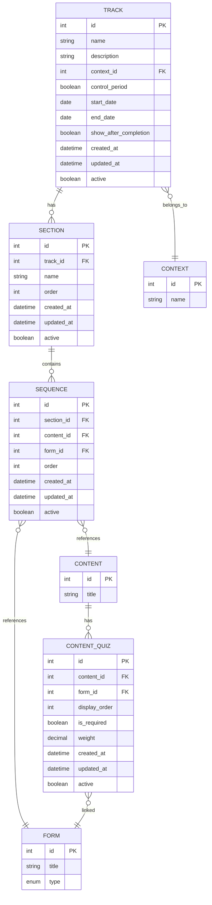

# Trilhas de Aprendizado

Esta seção detalha o modelo de dados relacionado a trilhas de aprendizado, seções e sequências.

## Diagrama



## Tabelas

### TRACK

Trilhas de aprendizado vinculadas a contextos.

| Campo | Tipo | Descrição |
|-------|------|-----------|
| `id` | INT | Identificador único (PK) |
| `name` | VARCHAR(255) | Nome da trilha |
| `description` | TEXT | Descrição da trilha |
| `context_id` | INT | Referência ao contexto (FK → context.id, opcional) |
| `control_period` | BOOLEAN | Se controla período de disponibilidade (default: false) |
| `start_date` | DATE | Data de início (se control_period = true) |
| `end_date` | DATE | Data de término (se control_period = true) |
| `show_after_completion` | BOOLEAN | Mostrar trilha após conclusão (default: false) |
| `created_at` | TIMESTAMP | Data de criação |
| `updated_at` | TIMESTAMP | Data de última atualização |
| `active` | BOOLEAN | Status ativo/inativo |

**Índices:**
- `idx_track_context_id` (context_id)
- `idx_track_active` (active)

### SECTION

Seções dentro de trilhas.

| Campo | Tipo | Descrição |
|-------|------|-----------|
| `id` | INT | Identificador único (PK) |
| `track_id` | INT | Referência à trilha (FK → track.id) |
| `name` | VARCHAR(255) | Nome da seção |
| `order` | INT | Ordem da seção na trilha (default: 0) |
| `created_at` | TIMESTAMP | Data de criação |
| `updated_at` | TIMESTAMP | Data de última atualização |
| `active` | BOOLEAN | Status ativo/inativo |

**Índices:**
- `idx_section_track_id` (track_id)
- `idx_section_order` (order)

### SEQUENCE

Sequências que podem conter conteúdo ou quiz.

| Campo | Tipo | Descrição |
|-------|------|-----------|
| `id` | INT | Identificador único (PK) |
| `section_id` | INT | Referência à seção (FK → section.id) |
| `content_id` | INT | Referência ao conteúdo (FK → content.id, opcional) |
| `form_id` | INT | Referência ao formulário/quiz (FK → form.id, opcional) |
| `order` | INT | Ordem na seção (default: 0) |
| `created_at` | TIMESTAMP | Data de criação |
| `updated_at` | TIMESTAMP | Data de última atualização |
| `active` | BOOLEAN | Status ativo/inativo |

**Constraints:**
- Uma sequência deve ter `content_id` OU `form_id` (não ambos, não nenhum)

**Índices:**
- `idx_sequence_section_id` (section_id)
- `idx_sequence_content_id` (content_id)
- `idx_sequence_form_id` (form_id)
- `idx_sequence_order` (order)

### CONTENT_QUIZ

Quizzes vinculados a conteúdos específicos.

| Campo | Tipo | Descrição |
|-------|------|-----------|
| `id` | INT | Identificador único (PK) |
| `content_id` | INT | Referência ao conteúdo (FK → content.id) |
| `form_id` | INT | Referência ao formulário/quiz (FK → form.id) |
| `display_order` | INT | Ordem de exibição no conteúdo (default: 0) |
| `is_required` | BOOLEAN | Se o quiz é obrigatório (default: false) |
| `weight` | DECIMAL(5,2) | Peso do quiz na avaliação (default: 1.0) |
| `created_at` | TIMESTAMP | Data de criação |
| `updated_at` | TIMESTAMP | Data de última atualização |
| `active` | BOOLEAN | Status ativo/inativo |

**Constraints:**
- UNIQUE (content_id, form_id) - Um conteúdo não pode ter o mesmo quiz duas vezes

**Índices:**
- `idx_content_quiz_content_id` (content_id)
- `idx_content_quiz_form_id` (form_id)
- `idx_content_quiz_display_order` (content_id, display_order)

## Relacionamentos

1. **TRACK → CONTEXT**: Uma trilha pode pertencer a um contexto (opcional)
2. **TRACK → SECTION**: Uma trilha tem múltiplas seções
3. **SECTION → SEQUENCE**: Uma seção tem múltiplas sequências
4. **SEQUENCE → CONTENT**: Uma sequência pode referenciar um conteúdo
5. **SEQUENCE → FORM**: Uma sequência pode referenciar um quiz
6. **CONTENT → CONTENT_QUIZ**: Um conteúdo pode ter múltiplos quizzes associados
7. **FORM → CONTENT_QUIZ**: Um quiz pode estar associado a múltiplos conteúdos

## Estrutura Hierárquica

```
TRACK (Trilha)
  └── SECTION (Seção 1)
      └── SEQUENCE (Conteúdo A)
      └── SEQUENCE (Quiz B)
      └── SEQUENCE (Conteúdo C)
  └── SECTION (Seção 2)
      └── SEQUENCE (Conteúdo D)
      └── SEQUENCE (Quiz E)
```

## Regras de Negócio

### Trilhas

- Uma trilha pode pertencer a um contexto (opcional)
- Se `control_period = true`, a trilha só está disponível entre `start_date` e `end_date`
- Se `show_after_completion = true`, a trilha permanece visível após conclusão
- Ao excluir uma trilha, todas as seções são excluídas (CASCADE)

### Seções

- Seções têm ordem (`order`) para controlar sequência na trilha
- Ao excluir uma seção, todas as sequências são excluídas (CASCADE)
- Ao excluir uma trilha, todas as seções são excluídas (CASCADE)

### Sequências

- Uma sequência deve ter **exatamente um** de: `content_id` ou `form_id`
- Sequências têm ordem (`order`) para controlar sequência na seção
- Uma sequência pode referenciar um conteúdo OU um quiz, não ambos
- Ao excluir uma seção, todas as sequências são excluídas (CASCADE)
- Ao excluir um conteúdo, as sequências que o referenciam são mantidas (ON UPDATE NO ACTION)
- Ao excluir um formulário, as sequências que o referenciam são mantidas (ON UPDATE NO ACTION)

### Quizzes em Conteúdo

- Um conteúdo pode ter múltiplos quizzes associados
- Um quiz pode estar associado a múltiplos conteúdos
- O campo `display_order` controla a ordem de exibição dos quizzes no conteúdo
- O campo `is_required` indica se o quiz é obrigatório para avançar
- O campo `weight` é usado para cálculo de pontuação ponderada
- A relação é única (um conteúdo não pode ter o mesmo quiz duas vezes)
- Ao excluir um conteúdo, seus quizzes associados são excluídos (CASCADE)
- Ao excluir um formulário, suas associações com conteúdos são excluídas (CASCADE)

## Consultas Comuns

### Buscar trilha completa com seções e sequências

```sql
SELECT 
  t.*,
  s.id as section_id,
  s.name as section_name,
  s.order as section_order,
  seq.id as sequence_id,
  seq.content_id,
  seq.form_id,
  seq.order as sequence_order
FROM track t
LEFT JOIN section s ON t.id = s.track_id AND s.active = true
LEFT JOIN sequence seq ON s.id = seq.section_id AND seq.active = true
WHERE t.id = ? AND t.active = true
ORDER BY s.order, seq.order;
```

### Verificar se trilha está disponível

```sql
SELECT 
  *,
  CASE 
    WHEN control_period = false THEN true
    WHEN control_period = true 
      AND start_date <= CURRENT_DATE 
      AND (end_date IS NULL OR end_date >= CURRENT_DATE) 
    THEN true
    ELSE false
  END as is_available
FROM track
WHERE id = ? AND active = true;
```

### Listar quizzes de um conteúdo

```sql
SELECT 
  cq.*,
  f.title as quiz_title,
  f.type as quiz_type
FROM content_quiz cq
INNER JOIN form f ON cq.form_id = f.id
WHERE cq.content_id = ?
  AND cq.active = true
  AND f.active = true
ORDER BY cq.display_order;
```

### Buscar progresso de trilha (conteúdos e quizzes)

```sql
SELECT 
  seq.id,
  seq.content_id,
  seq.form_id,
  CASE 
    WHEN seq.content_id IS NOT NULL THEN 'content'
    WHEN seq.form_id IS NOT NULL THEN 'quiz'
  END as sequence_type
FROM track t
INNER JOIN section s ON t.id = s.track_id
INNER JOIN sequence seq ON s.id = seq.section_id
WHERE t.id = ?
  AND t.active = true
  AND s.active = true
  AND seq.active = true
ORDER BY s.order, seq.order;
```
