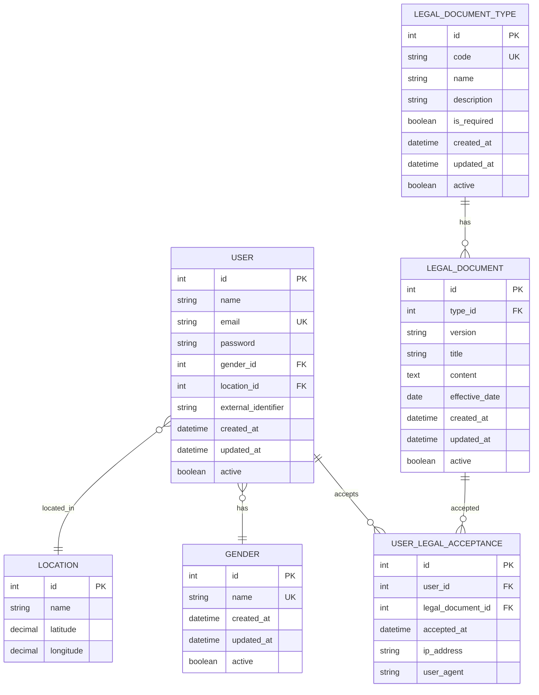

# Usuários e Autenticação

Esta seção detalha o modelo de dados relacionado a usuários, autenticação e perfis.

## Diagrama

## Tabelas

### USER

Armazena informações dos usuários do sistema.

| Campo | Tipo | Descrição |
|-------|------|-----------|
| `id` | INT | Identificador único (PK) |
| `name` | VARCHAR(255) | Nome completo do usuário |
| `email` | VARCHAR(255) | Email único (UK) |
| `password` | VARCHAR(255) | Senha criptografada |
| `gender_id` | INT | Referência ao gênero (FK → gender.id) |
| `location_id` | INT | Referência à localização (FK → location.id) |
| `external_identifier` | VARCHAR(100) | Identificador externo (opcional) |
| `created_at` | TIMESTAMP | Data de criação |
| `updated_at` | TIMESTAMP | Data de última atualização |
| `active` | BOOLEAN | Status ativo/inativo |

**Índices:**
- `idx_user_email` (email) - UNIQUE
- `idx_user_gender_id` (gender_id)
- `idx_user_location_id` (location_id)
- `idx_user_external_identifier` (external_identifier)

### GENDER

Tabela básica de gêneros.

| Campo | Tipo | Descrição |
|-------|------|-----------|
| `id` | INT | Identificador único (PK) |
| `name` | VARCHAR(50) | Nome do gênero (único) |
| `created_at` | TIMESTAMP | Data de criação |
| `updated_at` | TIMESTAMP | Data de última atualização |
| `active` | BOOLEAN | Status ativo/inativo |

**Índices:**
- `idx_gender_name` (name) - UNIQUE

### LEGAL_DOCUMENT_TYPE

Tipos de documentos legais (ex: Termo de Uso, Política de Privacidade).

| Campo | Tipo | Descrição |
|-------|------|-----------|
| `id` | INT | Identificador único (PK) |
| `code` | VARCHAR(50) | Código único do tipo |
| `name` | VARCHAR(100) | Nome do tipo |
| `description` | TEXT | Descrição |
| `is_required` | BOOLEAN | Se é obrigatório para usuários |
| `created_at` | TIMESTAMP | Data de criação |
| `updated_at` | TIMESTAMP | Data de última atualização |
| `active` | BOOLEAN | Status ativo/inativo |

**Índices:**
- `idx_legal_document_type_code` (code) - UNIQUE
- `idx_legal_document_type_active` (active)

### LEGAL_DOCUMENT

Versões de documentos legais.

| Campo | Tipo | Descrição |
|-------|------|-----------|
| `id` | INT | Identificador único (PK) |
| `type_id` | INT | Referência ao tipo (FK → legal_document_type.id) |
| `version` | VARCHAR(20) | Versão do documento |
| `title` | VARCHAR(255) | Título |
| `content` | TEXT | Conteúdo do documento |
| `effective_date` | DATE | Data de vigência |
| `created_at` | TIMESTAMP | Data de criação |
| `updated_at` | TIMESTAMP | Data de última atualização |
| `active` | BOOLEAN | Status ativo/inativo |

**Constraints:**
- UNIQUE (type_id, version) - Uma versão por tipo

**Índices:**
- `idx_legal_document_type_id` (type_id)
- `idx_legal_document_active` (active)
- `idx_legal_document_effective_date` (effective_date)

### USER_LEGAL_ACCEPTANCE

Registro de aceitação de documentos legais pelos usuários.

| Campo | Tipo | Descrição |
|-------|------|-----------|
| `id` | INT | Identificador único (PK) |
| `user_id` | INT | Referência ao usuário (FK → user.id) |
| `legal_document_id` | INT | Referência ao documento (FK → legal_document.id) |
| `accepted_at` | TIMESTAMP | Data/hora da aceitação |
| `ip_address` | VARCHAR(45) | IP do usuário no momento da aceitação |
| `user_agent` | TEXT | User agent do navegador |

**Constraints:**
- UNIQUE (user_id, legal_document_id) - Um usuário só pode aceitar uma vez cada documento

**Índices:**
- `idx_user_legal_acceptance_user_id` (user_id)
- `idx_user_legal_acceptance_document_id` (legal_document_id)
- `idx_user_legal_acceptance_accepted_at` (accepted_at)

## Relacionamentos

1. **USER → GENDER**: Um usuário tem um gênero (opcional)
2. **USER → LOCATION**: Um usuário está localizado em uma localização (opcional)
3. **USER → USER_LEGAL_ACCEPTANCE**: Um usuário pode aceitar múltiplos documentos legais
4. **LEGAL_DOCUMENT_TYPE → LEGAL_DOCUMENT**: Um tipo pode ter múltiplas versões
5. **LEGAL_DOCUMENT → USER_LEGAL_ACCEPTANCE**: Um documento pode ser aceito por múltiplos usuários

## Regras de Negócio

- Um usuário deve ter email único no sistema
- Um usuário pode ter um gênero associado (opcional)
- Um usuário pode ter uma localização associada (opcional)
- Documentos legais obrigatórios (`is_required = true`) devem ser aceitos antes do acesso completo
- Cada versão de documento legal é única por tipo
- Um usuário só pode aceitar uma vez cada documento legal
