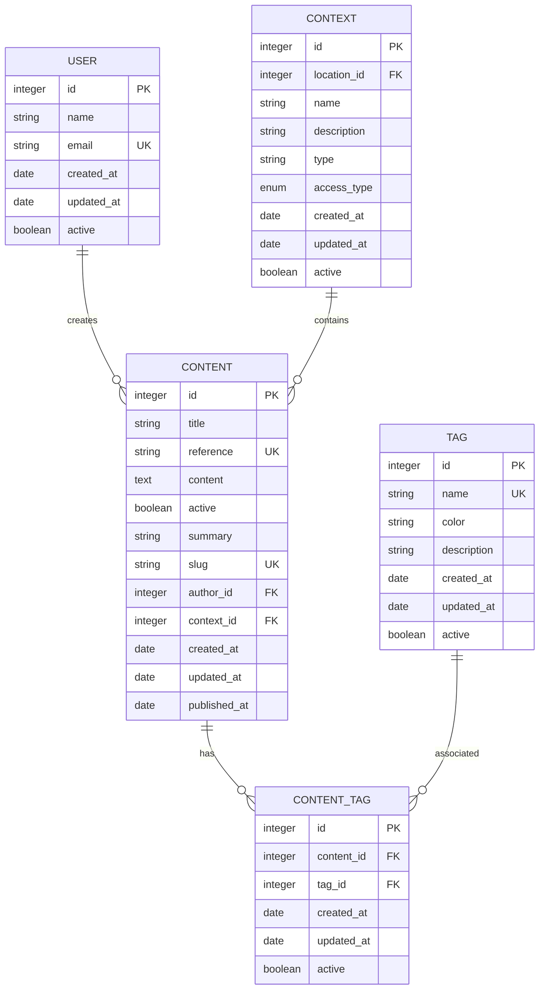
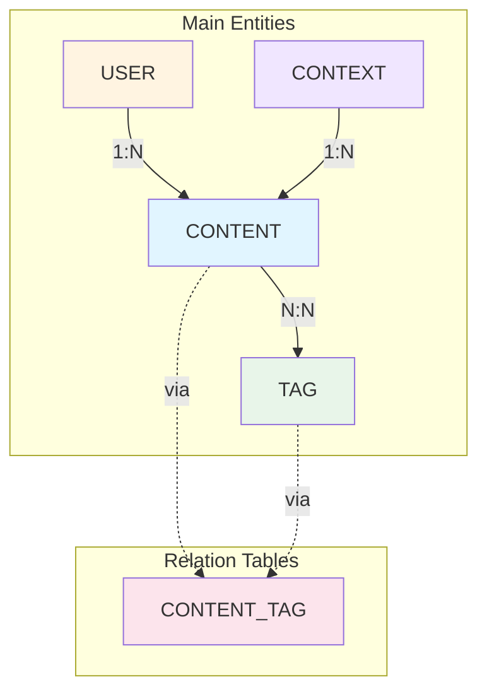

# Database Modeling

## Entity-Relationship Diagram (ER)

## Detailed Table Structure

### Table: `content`

| Campo          | Tipo         | Constraint              | Descrição                                     |
| -------------- | ------------ | ----------------------- | --------------------------------------------- |
| `id`           | SERIAL       | PRIMARY KEY             | Identificador único do conteúdo               |
| `title`        | VARCHAR(200) | NOT NULL                | Título do conteúdo                            |
| `reference`    | VARCHAR(50)  | NOT NULL, UNIQUE        | Código de referência (ex: "CON-001")          |
| `content`      | TEXT         | NOT NULL                | Conteúdo HTML formatado                       |
| `active`       | BOOLEAN      | NOT NULL, DEFAULT false | Status de publicação                          |
| `summary`      | VARCHAR(500) | NULL                    | Descrição curta do conteúdo                   |
| `slug`         | VARCHAR(255) | NOT NULL, UNIQUE        | URL amigável gerada do título                 |
| `author_id`    | INTEGER      | NOT NULL, FK → user.id  | Usuário criador do conteúdo                   |
| `context_id`   | INTEGER      | NULL, FK → context.id   | Contexto do conteúdo (NULL = toda comunidade) |
| `created_at`   | TIMESTAMP    | NOT NULL, DEFAULT NOW() | Data/hora de criação                          |
| `updated_at`   | TIMESTAMP    | NOT NULL, DEFAULT NOW() | Data/hora da última atualização               |
| `published_at` | TIMESTAMP    | NULL                    | Data/hora de publicação                       |

**Índices:**

- `idx_content_title` (title)
- `idx_content_reference` (reference) - UNIQUE
- `idx_content_slug` (slug) - UNIQUE
- `idx_content_active` (active)
- `idx_content_created_at` (created_at)
- `idx_content_author_id` (author_id)
- `idx_content_context_id` (context_id)

---

### Table: `tag`

| Campo         | Tipo         | Constraint              | Descrição                                     |
| ------------- | ------------ | ----------------------- | --------------------------------------------- |
| `id`          | SERIAL       | PRIMARY KEY             | Identificador único da tag                    |
| `name`        | VARCHAR(100) | NOT NULL, UNIQUE        | Nome da tag                                   |
| `color`       | VARCHAR(7)   | NULL                    | Cor hexadecimal para exibição (ex: "#FF5733") |
| `description` | VARCHAR(255) | NULL                    | Descrição da tag                              |
| `created_at`  | TIMESTAMP    | NOT NULL, DEFAULT NOW() | Data/hora de criação                          |
| `updated_at`  | TIMESTAMP    | NOT NULL, DEFAULT NOW() | Data/hora da última atualização               |
| `active`      | BOOLEAN      | NOT NULL, DEFAULT true  | Status ativo da tag                           |

**Índices:**

- `idx_tag_name` (name) - UNIQUE

---

### Table: `content_tag` (N to N Relation)

| Campo        | Tipo      | Constraint                | Descrição                       |
| ------------ | --------- | ------------------------- | ------------------------------- |
| `id`         | SERIAL    | PRIMARY KEY               | Identificador único da relação  |
| `content_id` | INTEGER   | NOT NULL, FK → content.id | Referência ao conteúdo          |
| `tag_id`     | INTEGER   | NOT NULL, FK → tag.id     | Referência à tag                |
| `created_at` | TIMESTAMP | NOT NULL, DEFAULT NOW()   | Data/hora da associação         |
| `updated_at` | TIMESTAMP | NOT NULL, DEFAULT NOW()   | Data/hora da última atualização |
| `active`     | BOOLEAN   | NOT NULL, DEFAULT true    | Status ativo da associação      |

**Índices:**

- `idx_content_tag_content_id` (content_id)
- `idx_content_tag_tag_id` (tag_id)
- `idx_content_tag_unique` (content_id, tag_id) - UNIQUE (evita duplicatas)

---

### Table: `user`

| Campo        | Tipo         | Constraint              | Descrição                       |
| ------------ | ------------ | ----------------------- | ------------------------------- |
| `id`         | INT          | PRIMARY KEY             | Identificador único do usuário  |
| `name`       | VARCHAR(200) | NOT NULL                | Nome completo do usuário        |
| `email`      | VARCHAR(255) | NOT NULL, UNIQUE        | Email do usuário                |
| `created_at` | TIMESTAMP    | NOT NULL, DEFAULT NOW() | Data/hora de criação            |
| `updated_at` | TIMESTAMP    | NOT NULL, DEFAULT NOW() | Data/hora da última atualização |
| `active`     | BOOLEAN      | NOT NULL, DEFAULT true  | Status ativo do usuário         |

**Índices:**

- `idx_user_email` (email) - UNIQUE

---

### Table: `context`

| Campo         | Tipo         | Constraint              | Descrição                       |
| ------------- | ------------ | ----------------------- | ------------------------------- |
| `id`          | INT          | PRIMARY KEY             | Identificador único do contexto |
| `location_id` | INTEGER      | NULL, FK → location.id  | Referência à localização        |
| `name`        | VARCHAR(200) | NOT NULL                | Nome do contexto                |
| `description` | VARCHAR(500) | NULL                    | Descrição do contexto           |
| `type`        | VARCHAR(100) | NULL                    | Tipo do contexto                |
| `access_type` | ENUM         | NULL                    | Tipo de acesso do contexto      |
| `created_at`  | TIMESTAMP    | NOT NULL, DEFAULT NOW() | Data/hora de criação            |
| `updated_at`  | TIMESTAMP    | NOT NULL, DEFAULT NOW() | Data/hora da última atualização |
| `active`      | BOOLEAN      | NOT NULL, DEFAULT true  | Status ativo do contexto        |

**Índices:**

- `idx_context_location_id` (location_id)
- `idx_context_name` (name)

---

## Detailed Relationships Diagram

## Business Rules

### Content

- Content must have title, reference and content fields
- Reference must be unique in the system
- Slug is automatically generated from title and must be unique
- When `active = true`, the `published_at` field must be filled
- Content can have multiple tags
- Content belongs to a single author
- Content can belong to a context (NULL = available for entire community, specific context = only for that context)

### Tags

- Tag name must be unique
- A tag can be associated with multiple contents
- When deleting a tag, check if there are associated contents (cascade or restriction)

### Context

- Context represents a specific location or community (e.g., UNB, Cabo Verde)
- When `context_id` is NULL in content, it means the content is available for the entire community
- When `context_id` is set, the content is specific to that context
- Context can have a location_id for geographic reference

## Implementation Notes

1. **ID Types**: The model uses SERIAL (auto-increment INTEGER) which is native to PostgreSQL and offers better performance for sequential primary keys.

2. **Soft Delete**: Consider adding `deleted_at` field for soft delete instead of physical deletion.

3. **Full-Text Search**: For advanced search, consider full-text indexes in PostgreSQL or Elasticsearch.

4. **Performance**:

   - Cache active contents in Redis/Memcached
   - Composite indexes for frequent queries
   - Pagination whenever possible

5. **Validações**:
   - Slug must be automatically generated and sanitized
   - Reference can have specific format (ex: "CON-YYYY-NNN")
   - Content HTML must be sanitized for security (XSS)

---
