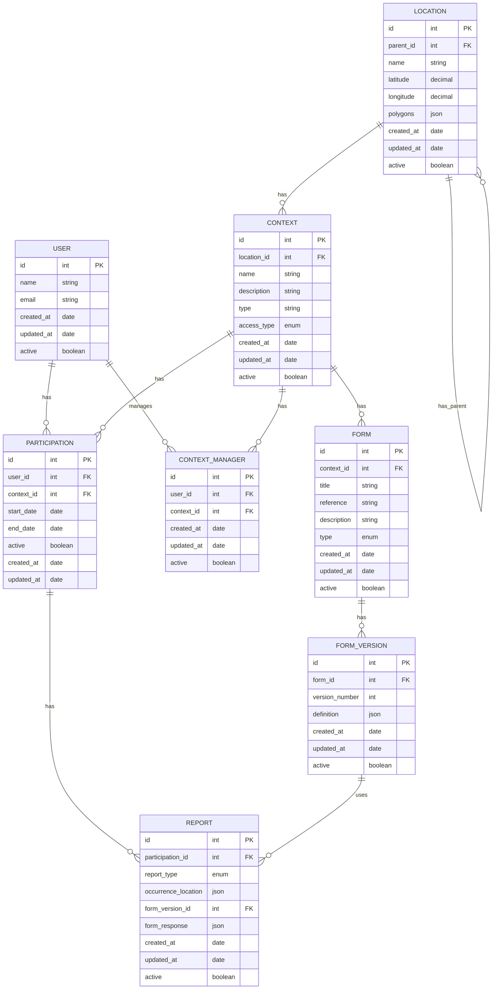

# ER Diagram (Entity-Relationship)

# Anotações

## Enums

**access_type** (CONTEXT): PUBLIC | PRIVATE

**access_type** (FORM_VERSION): PUBLIC | PRIVATE

**report_type** (REPORT): POSITIVE | NEGATIVE

**form_type** (FORM): signal,quiz

## Observações

- **FORM.context_id**: Se NULL, o formulário é público e pode ser reutilizado. Se preenchido, é privado do contexto específico.
- **FORM_VERSION.access_type**: Controla se uma versão específica do formulário é pública ou privada para reuso.
