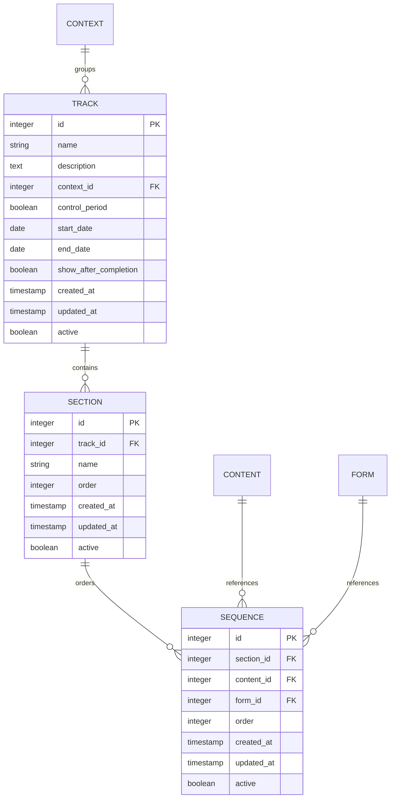

# Database Modeling – Content Tracks (Trilhas)

Este módulo é responsável por organizar conteúdos e formulários em **trilhas estruturadas**, permitindo progressão lógica, controle por período e segmentação por contexto.

---

## Entity-Relationship Diagram (ER)

---

## Detailed Table Structure

### Table: `track`

Representa uma **trilha de aprendizado/conteúdo**, que pode ser associada a um contexto específico e opcionalmente controlada por período.

| Campo                   | Tipo         | Constraint                          | Descrição                                           |
| ----------------------- | ------------ | ----------------------------------- | --------------------------------------------------- |
| `id`                    | SERIAL       | PRIMARY KEY                         | Identificador único da trilha                       |
| `name`                  | VARCHAR(255) | NOT NULL                            | Nome da trilha                                      |
| `description`           | TEXT         | NULL                                | Descrição detalhada da trilha                       |
| `context_id`            | INTEGER      | FK → context.id                     | Contexto ao qual a trilha pertence                  |
| `control_period`        | BOOLEAN      | NOT NULL, DEFAULT false             | Indica se a trilha possui controle de período       |
| `start_date`            | DATE         | NULL                                | Data de início da trilha                            |
| `end_date`              | DATE         | NULL                                | Data de fim da trilha                               |
| `show_after_completion` | BOOLEAN      | NOT NULL, DEFAULT false             | Indica se a trilha permanece visível após conclusão |
| `created_at`            | TIMESTAMP    | NOT NULL, DEFAULT CURRENT_TIMESTAMP | Data/hora de criação                                |
| `updated_at`            | TIMESTAMP    | NOT NULL, DEFAULT CURRENT_TIMESTAMP | Data/hora da última atualização                     |
| `active`                | BOOLEAN      | NOT NULL, DEFAULT true              | Status ativo da trilha                              |

**Índices:**

- `idx_track_context_id` (context_id)
- `idx_track_active` (active)

---

### Table: `section`

Representa **seções internas de uma trilha**, usadas para agrupar conteúdos em blocos lógicos.

| Campo        | Tipo         | Constraint                          | Descrição                                   |
| ------------ | ------------ | ----------------------------------- | ------------------------------------------- |
| `id`         | SERIAL       | PRIMARY KEY                         | Identificador único da seção                |
| `track_id`   | INTEGER      | NOT NULL, FK → track.id             | Trilha à qual a seção pertence              |
| `name`       | VARCHAR(255) | NOT NULL                            | Nome da seção                               |
| `order`      | INTEGER      | NOT NULL, DEFAULT 0                 | Ordem de exibição da seção dentro da trilha |
| `created_at` | TIMESTAMP    | NOT NULL, DEFAULT CURRENT_TIMESTAMP | Data/hora de criação                        |
| `updated_at` | TIMESTAMP    | NOT NULL, DEFAULT CURRENT_TIMESTAMP | Data/hora da última atualização             |
| `active`     | BOOLEAN      | NOT NULL, DEFAULT true              | Status ativo da seção                       |

**Índices:**

- `idx_section_track_id` (track_id)
- `idx_section_order` (order)

---

### Table: `sequence`

Representa a **ordem dos itens dentro de uma seção**, podendo referenciar **conteúdos** ou **formulários**.

| Campo        | Tipo      | Constraint                          | Descrição                         |
| ------------ | --------- | ----------------------------------- | --------------------------------- |
| `id`         | SERIAL    | PRIMARY KEY                         | Identificador único da sequência  |
| `section_id` | INTEGER   | NOT NULL, FK → section.id           | Seção à qual o item pertence      |
| `content_id` | INTEGER   | NULL, FK → content.id               | Conteúdo associado (opcional)     |
| `form_id`    | INTEGER   | NULL, FK → form.id                  | Formulário associado (opcional)   |
| `order`      | INTEGER   | NOT NULL, DEFAULT 0                 | Ordem do item dentro da seção     |
| `created_at` | TIMESTAMP | NOT NULL, DEFAULT CURRENT_TIMESTAMP | Data/hora de criação              |
| `updated_at` | TIMESTAMP | NOT NULL, DEFAULT CURRENT_TIMESTAMP | Data/hora da última atualização   |
| `active`     | BOOLEAN   | NOT NULL, DEFAULT true              | Status ativo do item da sequência |

**Índices:**

- `idx_sequence_section_id` (section_id)
- `idx_sequence_content_id` (content_id)
- `idx_sequence_form_id` (form_id)
- `idx_sequence_order` (order)

---

## Business Rules

- Trilhas organizam conteúdos e formulários em fluxo progressivo
- Seções agrupam itens logicamente
- Sequências definem a ordem de consumo
