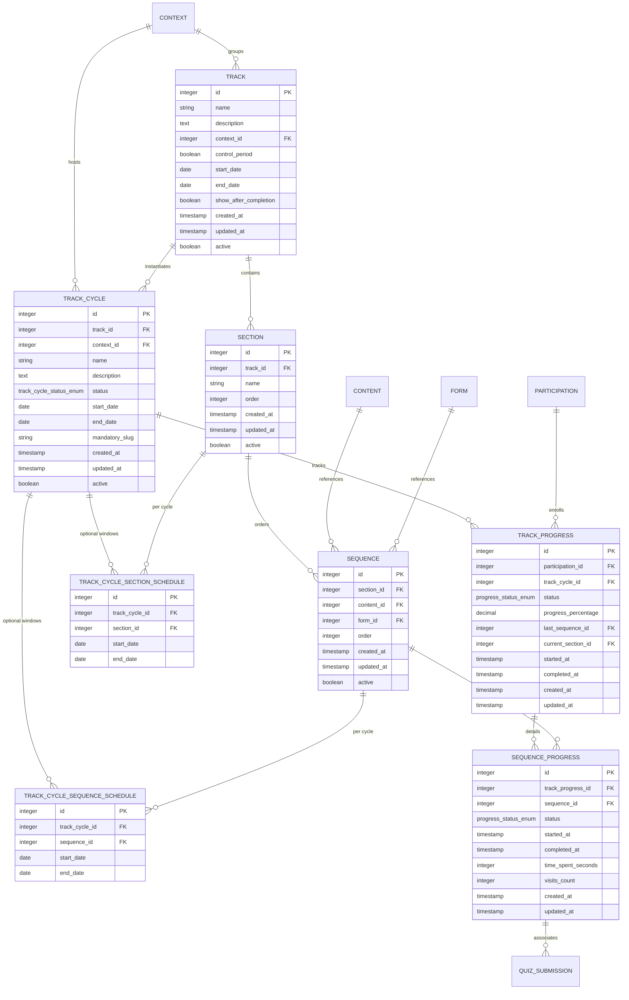

# Database Modeling v2 – Content Tracks with Cycles, Progress & Executions

Este módulo organiza conteúdos e formulários em **trilhas estruturadas**, permitindo progressão lógica, controle por período, segmentação por contexto, rastreamento de progresso e registro de execuções.

A modelagem v2 estende a estrutura base (trilhas, seções, sequências) com suporte a **ciclos de trilhas**, **progresso de usuários** e **registro de execuções** de atividades.

---

## Entity-Relationship Diagram (ER)



---

## Detailed Table Structure

### Table: `track`

Representa uma **trilha de aprendizado/conteúdo**, que pode ser associada a um contexto específico e opcionalmente controlada por período.

| Campo                   | Tipo         | Constraint                          | Descrição                                           |
| ----------------------- | ------------ | ----------------------------------- | --------------------------------------------------- |
| `id`                    | SERIAL       | PRIMARY KEY                         | Identificador único da trilha                       |
| `name`                  | VARCHAR(255) | NOT NULL                            | Nome da trilha                                      |
| `description`           | TEXT         | NULL                                | Descrição detalhada da trilha                       |
| `context_id`            | INTEGER      | FK → context.id                     | Contexto ao qual a trilha pertence                  |
| `control_period`        | BOOLEAN      | NOT NULL, DEFAULT false             | Indica se a trilha possui controle de período       |
| `start_date`            | DATE         | NULL                                | Data de início da trilha                            |
| `end_date`              | DATE         | NULL                                | Data de fim da trilha                               |
| `show_after_completion` | BOOLEAN      | NOT NULL, DEFAULT false             | Indica se a trilha permanece visível após conclusão |
| `created_at`            | TIMESTAMP    | NOT NULL, DEFAULT CURRENT_TIMESTAMP | Data/hora de criação                                |
| `updated_at`            | TIMESTAMP    | NOT NULL, DEFAULT CURRENT_TIMESTAMP | Data/hora da última atualização                     |
| `active`                | BOOLEAN      | NOT NULL, DEFAULT true              | Status ativo da trilha                              |

**Índices:**
- `idx_track_context_id` (context_id)
- `idx_track_active` (active)

---

### Table: `section`

Representa **seções internas de uma trilha**, usadas para agrupar conteúdos em blocos lógicos.

| Campo        | Tipo         | Constraint                          | Descrição                                   |
| ------------ | ------------ | ----------------------------------- | ------------------------------------------- |
| `id`         | SERIAL       | PRIMARY KEY                         | Identificador único da seção                |
| `track_id`   | INTEGER      | NOT NULL, FK → track.id             | Trilha à qual a seção pertence              |
| `name`       | VARCHAR(255) | NOT NULL                            | Nome da seção                               |
| `order`      | INTEGER      | NOT NULL, DEFAULT 0                 | Ordem de exibição da seção dentro da trilha |
| `created_at` | TIMESTAMP    | NOT NULL, DEFAULT CURRENT_TIMESTAMP | Data/hora de criação                        |
| `updated_at` | TIMESTAMP    | NOT NULL, DEFAULT CURRENT_TIMESTAMP | Data/hora da última atualização             |
| `active`     | BOOLEAN      | NOT NULL, DEFAULT true              | Status ativo da seção                       |

**Índices:**
- `idx_section_track_id` (track_id)
- `idx_section_order` (order)

---

### Table: `sequence`

Representa a **ordem dos itens dentro de uma seção**, podendo referenciar **conteúdos** ou **formulários**.

| Campo        | Tipo      | Constraint                          | Descrição                         |
| ------------ | --------- | ----------------------------------- | --------------------------------- |
| `id`         | SERIAL    | PRIMARY KEY                         | Identificador único da sequência  |
| `section_id` | INTEGER   | NOT NULL, FK → section.id           | Seção à qual o item pertence      |
| `content_id` | INTEGER   | NULL, FK → content.id               | Conteúdo associado (opcional)     |
| `form_id`    | INTEGER   | NULL, FK → form.id                  | Formulário associado (opcional)   |
| `order`      | INTEGER   | NOT NULL, DEFAULT 0                 | Ordem do item dentro da seção     |
| `created_at` | TIMESTAMP | NOT NULL, DEFAULT CURRENT_TIMESTAMP | Data/hora de criação              |
| `updated_at` | TIMESTAMP | NOT NULL, DEFAULT CURRENT_TIMESTAMP | Data/hora da última atualização   |
| `active`     | BOOLEAN   | NOT NULL, DEFAULT true              | Status ativo do item da sequência |

**Índices:**
- `idx_sequence_section_id` (section_id)
- `idx_sequence_content_id` (content_id)
- `idx_sequence_form_id` (form_id)
- `idx_sequence_order` (order)

---

### Table: `track_cycle`

Representa uma **instância/oferta de trilha** em um contexto e período específicos. Permite que a mesma trilha seja executada múltiplas vezes em diferentes momentos ou contextos.

| Campo            | Tipo                       | Constraint                          | Descrição                                                    |
| ---------------- | -------------------------- | ----------------------------------- | ------------------------------------------------------------ |
| `id`             | SERIAL                     | PRIMARY KEY                         | Identificador único do ciclo                                 |
| `track_id`       | INTEGER                    | NOT NULL, FK → track.id             | Trilha que está sendo instanciada                            |
| `context_id`     | INTEGER                    | NOT NULL, FK → context.id           | Contexto onde o ciclo está ocorrendo                         |
| `name`           | VARCHAR(100)               | NOT NULL                            | Nome/código do ciclo (ex: "2026.1", "Primeiro Semestre")    |
| `description`    | TEXT                       | NULL                                | Descrição detalhada do ciclo                                 |
| `status`         | track_cycle_status_enum    | NOT NULL, DEFAULT 'draft'           | Status atual do ciclo                                        |
| `start_date`     | DATE                       | NOT NULL                            | Data de início do ciclo                                      |
| `end_date`       | DATE                       | NOT NULL                            | Data de término do ciclo                                     |
| `mandatory_slug` | VARCHAR(80)                | NULL, UNIQUE (when not null)        | Slug único que marca o ciclo como trilha obrigatória (V9)    |
| `created_at`     | TIMESTAMP(6)               | DEFAULT CURRENT_TIMESTAMP           | Data/hora de criação                                         |
| `updated_at`     | TIMESTAMP(6)               | DEFAULT CURRENT_TIMESTAMP           | Data/hora da última atualização                              |
| `active`         | BOOLEAN                    | DEFAULT true                        | Flag de ativo (soft delete)                                  |

**Constraints:**
- `chk_track_cycle_dates`: `end_date >= start_date`
- `uq_track_cycle_track_context_name`: UNIQUE (track_id, context_id, name)

**Índices:**
- `idx_track_cycle_track_id` (track_id)
- `idx_track_cycle_context_id` (context_id)
- `idx_track_cycle_status` (status)
- `idx_track_cycle_dates` (start_date, end_date)
- `idx_track_cycle_mandatory_slug` (mandatory_slug) WHERE mandatory_slug IS NOT NULL

---

### Table: `track_cycle_section_schedule`

Janelas de data **opcionais** por **seção**, escopadas a um **ciclo** (`track_cycle`). A mesma trilha pode ser ofertada em ciclos diferentes com períodos distintos por seção, sem alterar a entidade `section` compartilhada.

| Campo            | Tipo    | Constraint                          | Descrição                                                |
| ---------------- | ------- | ----------------------------------- | -------------------------------------------------------- |
| `id`             | SERIAL  | PRIMARY KEY                         | Identificador                                            |
| `track_cycle_id` | INTEGER | NOT NULL, FK → track_cycle.id       | Ciclo ao qual o override pertence                        |
| `section_id`     | INTEGER | NOT NULL, FK → section.id           | Seção da trilha do ciclo                                 |
| `start_date`     | DATE    | NULL                                | Início efetivo opcional (herda do ciclo se NULL)         |
| `end_date`       | DATE    | NULL                                | Término efetivo opcional (herda do ciclo se NULL)        |

**Constraints:** `UNIQUE (track_cycle_id, section_id)`; validação de aplicação garante interseção não vazia com o intervalo do ciclo após *clamp*.

---

### Table: `track_cycle_sequence_schedule`

Janelas opcionais por **sequência** (item de conteúdo/quiz), escopadas ao ciclo. Herança em cascata: após calcular a janela efetiva da seção, aplica-se o mesmo padrão ao item.

| Campo            | Tipo    | Constraint                          | Descrição                                                |
| ---------------- | ------- | ----------------------------------- | -------------------------------------------------------- |
| `id`             | SERIAL  | PRIMARY KEY                         | Identificador                                            |
| `track_cycle_id` | INTEGER | NOT NULL, FK → track_cycle.id       | Ciclo                                                    |
| `sequence_id`    | INTEGER | NOT NULL, FK → sequence.id          | Sequência (item) na trilha                               |
| `start_date`     | DATE    | NULL                                | Início opcional (herda da janela efetiva da seção)       |
| `end_date`       | DATE    | NULL                                | Término opcional                                         |

**Constraints:** `UNIQUE (track_cycle_id, sequence_id)`.

**Semântica:** ausência de linha ou campo `NULL` em `start_date`/`end_date` significa herdar do nível superior (ciclo → seção → sequência). A API admin pode substituir todos os overrides de um ciclo com `PUT /v1/track-cycles/:id/schedules` (corpo idempotente).

**Fuso de referência para “hoje”:** `America/Sao_Paulo` (alinhado ao restante do produto em BRT), comparando datas civis.

---

### Table: `track_progress`

Rastreia o **progresso geral do usuário** em um ciclo de trilha específico. Registra métricas agregadas e status global.

| Campo                  | Tipo                    | Constraint                           | Descrição                                                  |
| ---------------------- | ----------------------- | ------------------------------------ | ---------------------------------------------------------- |
| `id`                   | SERIAL                  | PRIMARY KEY                          | Identificador único do progresso                           |
| `participation_id`     | INTEGER                 | NOT NULL, FK → participation.id      | Participação (usuário + contexto) que possui o progresso   |
| `track_cycle_id`       | INTEGER                 | NOT NULL, FK → track_cycle.id        | Ciclo de trilha sendo acompanhado                          |
| `status`               | progress_status_enum    | NOT NULL, DEFAULT 'in_progress'      | Status geral do progresso                                  |
| `progress_percentage`  | DECIMAL(5,2)            | NOT NULL, DEFAULT 0.00               | Percentual de conclusão (calculado automaticamente)        |
| `last_sequence_id`     | INTEGER                 | NULL, FK → sequence.id               | Última sequência acessada (para retomar de onde parou)     |
| `current_section_id`   | INTEGER                 | NULL, FK → section.id                | Seção atual do usuário                                     |
| `started_at`           | TIMESTAMP(6)            | NULL                                 | Data/hora de início do progresso                           |
| `completed_at`         | TIMESTAMP(6)            | NULL                                 | Data/hora de conclusão (quando status = completed)         |
| `created_at`           | TIMESTAMP(6)            | DEFAULT CURRENT_TIMESTAMP            | Data/hora de criação do registro                           |
| `updated_at`           | TIMESTAMP(6)            | DEFAULT CURRENT_TIMESTAMP            | Data/hora da última atualização                            |

**Constraints:**
- `chk_track_progress_percentage`: `progress_percentage >= 0.00 AND progress_percentage <= 100.00`
- `uq_track_progress_participation_cycle`: UNIQUE (participation_id, track_cycle_id)

**Índices:**
- `idx_track_progress_participation` (participation_id)
- `idx_track_progress_cycle` (track_cycle_id)
- `idx_track_progress_status` (status)
- `idx_track_progress_completed_at` (completed_at)

---

### Table: `sequence_progress`

Rastreia o **progresso detalhado** de cada sequência (conteúdo ou quiz) dentro de um ciclo. Esta tabela é a **base do sistema de registro de execuções**.

| Campo                  | Tipo                 | Constraint                           | Descrição                                            |
| ---------------------- | -------------------- | ------------------------------------ | ---------------------------------------------------- |
| `id`                   | SERIAL               | PRIMARY KEY                          | Identificador único do progresso da sequência        |
| `track_progress_id`    | INTEGER              | NOT NULL, FK → track_progress.id     | Progresso da trilha ao qual pertence                 |
| `sequence_id`          | INTEGER              | NOT NULL, FK → sequence.id           | Sequência (atividade) sendo rastreada                |
| `status`               | progress_status_enum | NOT NULL, DEFAULT 'not_started'      | Status da sequência                                  |
| `started_at`           | TIMESTAMP(6)         | NULL                                 | Data/hora de primeiro acesso                         |
| `completed_at`         | TIMESTAMP(6)         | NULL                                 | **Data/hora de conclusão** (campo chave para execuções) |
| `time_spent_seconds`   | INTEGER              | NULL                                 | Tempo total gasto na atividade (em segundos)         |
| `visits_count`         | INTEGER              | NOT NULL, DEFAULT 0                  | Número de vezes que o usuário visitou a atividade    |
| `created_at`           | TIMESTAMP(6)         | DEFAULT CURRENT_TIMESTAMP            | Data/hora de criação do registro                     |
| `updated_at`           | TIMESTAMP(6)         | DEFAULT CURRENT_TIMESTAMP            | Data/hora da última atualização                      |

**Constraints:**
- `chk_sequence_progress_visits`: `visits_count >= 0`
- `uq_sequence_progress_track_sequence`: UNIQUE (track_progress_id, sequence_id)

**Índices:**
- `idx_sequence_progress_track_progress` (track_progress_id)
- `idx_sequence_progress_sequence` (sequence_id)
- `idx_sequence_progress_status` (status)
- `idx_sequence_progress_completed_at` (completed_at)

---

### Modification: `quiz_submission`

**Nova Coluna Adicionada:**

| Campo                  | Tipo    | Constraint                          | Descrição                                                    |
| ---------------------- | ------- | ----------------------------------- | ------------------------------------------------------------ |
| `sequence_progress_id` | INTEGER | NULL, FK → sequence_progress.id     | Vincula submissão ao progresso (NULL para quizzes avulsos)   |

**Índice:**
- `idx_quiz_submission_sequence_progress` (sequence_progress_id)

---

## Enums

### `progress_status_enum`
- `not_started`: Não iniciado
- `in_progress`: Em progresso
- `completed`: Concluído

### `track_cycle_status_enum`
- `draft`: Rascunho
- `active`: Ativo
- `closed`: Encerrado
- `archived`: Arquivado

---

## Business Rules

### Trilhas e Estrutura
- Trilhas organizam conteúdos e formulários em fluxo progressivo
- Seções agrupam itens logicamente
- Sequências definem a ordem de consumo
- Uma sequência deve referenciar conteúdo OU formulário (nunca ambos)

### Ciclos de Trilhas
- Uma trilha pode ter múltiplos ciclos em diferentes contextos e períodos
- Cada ciclo tem nome único dentro da combinação trilha + contexto
- Apenas um ciclo pode ter status 'active' por vez para a mesma trilha/contexto
- Datas de ciclos devem ser válidas (end_date >= start_date)
- Slugs obrigatórios (`mandatory_slug`) são únicos em todo o sistema
- Ciclos não podem ser deletados se houver progresso associado

### Progresso de Usuários
- Um usuário (via `participation_id`) pode ter apenas um registro de progresso por ciclo
- Progresso é criado ao iniciar um ciclo (endpoint `/track-progress/start`); o ciclo precisa estar vigente (`today` dentro de `[start_date, end_date]` do ciclo)
- Percentual calculado automaticamente: `(sequências completadas / total) * 100`
- Status = 'completed' quando `progress_percentage = 100%`
- Bloqueio sequencial: usuário só acessa próxima sequência após completar a anterior
- Bloqueio por agenda: além da ordem, `canAccessSequence`, gravação de progresso e conclusão respeitam a janela efetiva da sequência; a resposta de progresso pode incluir `sequence_schedule_state` (`open` | `upcoming` | `expired`) por item para a UI

### Registro de Execuções
- Toda conclusão de sequência gera um registro (via `sequence_progress.completed_at`)
- Conteúdos marcados como completos automaticamente ao visualizar
- Quizzes marcados como completos após submissão aprovada
- Campo `completed_at` é usado para consultas de execuções (endpoint `/track-progress/executions`)
- Filtros disponíveis: ciclo, participante, tipo, nome da atividade, período
- Suporte a exportação de relatórios em CSV

### Trilhas Obrigatórias
- Identificadas pelo campo `mandatory_slug` não nulo
- Apenas um ciclo no sistema pode ter cada valor de slug
- Validação de conformidade verifica se usuário completou ciclos com slugs obrigatórios do contexto
- Endpoint `/track-progress/mandatory-compliance` retorna status de conformidade

---

## Comentários nas Tabelas

```sql
COMMENT ON TABLE track_cycle IS 'Instâncias/ofertas de trilhas em contextos específicos com períodos definidos';
COMMENT ON COLUMN track_cycle.name IS 'Nome/código do ciclo (ex: 2026.1, Primeiro Semestre)';
COMMENT ON COLUMN track_cycle.status IS 'Status do ciclo: draft, active, closed, archived';
COMMENT ON COLUMN track_cycle.mandatory_slug IS 'Slug único que marca o ciclo como trilha obrigatória; NULL = não obrigatório';

COMMENT ON TABLE track_progress IS 'Progresso geral do usuário em um ciclo de trilha';
COMMENT ON COLUMN track_progress.progress_percentage IS 'Percentual: (sequências concluídas / total) * 100';
COMMENT ON COLUMN track_progress.last_sequence_id IS 'Última sequência visitada para retomar de onde parou';

COMMENT ON TABLE sequence_progress IS 'Progresso detalhado em cada sequência (base do registro de execuções)';
COMMENT ON COLUMN sequence_progress.visits_count IS 'Número de vezes que o usuário visitou esta sequência';
COMMENT ON COLUMN sequence_progress.time_spent_seconds IS 'Tempo total gasto na sequência em segundos';
COMMENT ON COLUMN sequence_progress.completed_at IS 'Data/hora de conclusão (usado para registro de execuções)';

COMMENT ON COLUMN quiz_submission.sequence_progress_id IS 'Vincula submissão ao progresso (NULL para quizzes avulsos)';
```
